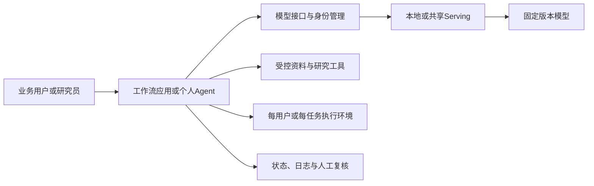

# Harness与AI应用调研：它们能帮基金公司完成什么工作

**更新日期：**2026年9月18日。文件路径沿用9月17日版本，便于原链接持续有效。

**修改前检查点：**`d3057af`（当前24页报告与既有研究）；上一轮资料扩展检查点为`9e5c2fe`。

**阅读方式：**第3节比较员工工作台，第6节比较Hermes与OpenClaw，第8节分析Coding Agent＋Skills／MCP；其余章节保留资料平台、固定流程及开发框架。

**配套：**[Serving调研](serving-framework-survey-2026-09-17.md)、[模型候选](../models/model-survey-2026-09-16.md)、[参考架构](reference-architecture.md)。

本轮按用户反馈重新安排介绍重点，并核对截至2026年9月18日的官方仓库、产品文档和发布记录。研究以功能、优势、业务用途和具体运行形态为主；来源原件及版本保存在TECH-056–063。业务任务为参考设计，测量方法见第11节。

## 1. 先说明我们在选择什么

模型部署完成后，同事还需要一个地方提问、上传资料、保存工作结果，并在需要时让模型查询数据、处理文件或执行流程。这里的软件决定了同事最终得到的是一个聊天窗口、一个知识检索助手，还是能够持续完成任务的助手。

狭义的**harness**负责把模型调用、工具使用和任务状态组织起来。实际选型还要看包含这些能力的完整应用：员工不一定需要自己操作harness的底层接口。现成工作台、通用执行环境和业务框架可以组合使用：界面负责同事怎样工作，harness负责模型怎样持续执行。

“非coding”描述的是用户的工作。研究员让助手整理表格、画图、比较财报时，助手内部仍可能执行代码；评价重点应是得到的材料是否准确、可核对、可继续使用，而不是界面有没有终端。

## 2. 给mentor的用途总览

| 希望同事能够做什么 | 软件类型 | 重点项目 | 主要价值 |
|---|---|---|---|
| 用内部模型聊天、读文件、整理初稿 | 员工AI工作台 | Open WebUI、LobeHub、Cherry Studio | 提供现成入口，减少每个人独立配置模型和工具的负担 |
| 从大量分散资料中找依据、回答问题、形成研究材料 | 企业知识与资料研究平台 | Onyx、RAGFlow | 把资料接入、检索和引用核查组织成完整工作 |
| 按固定步骤处理公告、材料预审或运营任务 | 可视化应用与自动化平台 | Dify、Flowise、n8n | 将一次有效的方法做成可重复使用的业务流程 |
| 交给助手一个目标，让它读取文件、调用工具并交付结果 | 通用任务助手 | Hermes Agent、OpenClaw | 减少用户在聊天、文件、查询和计算工具间反复切换 |
| 按部门系统和业务规则建设专用助手 | Agent开发框架 | LangGraph、Microsoft Agent Framework、Agno、CrewAI | 更好地控制业务逻辑、工具、状态和人工处理环节 |

这些产品正在汇合：工作台可以直接接入成熟的Coding Agent，通用助手可以复用Skills和MCP，流程平台可以调用Agent完成其中一段研究工作。分类用于解释工作方式，具体比较围绕同一业务产物展开。

## 3. 员工AI工作台：先让模型成为能用的日常工具

### 3.1 Open WebUI：公司内部统一的AI入口

**做什么：**提供自托管的聊天工作台，让员工选择模型、上传文件、使用知识库，并通过配置好的工具完成更多操作。它能连接Ollama和OpenAI兼容模型服务，包括自建GPU服务。[官方项目](https://github.com/open-webui/open-webui)、[功能资料](../sources/TECH-043/features.md)。

**主要优点：**

- 同事通过浏览器使用，后台模型和服务位置可以集中管理。
- 文档问答、共享工具及角色/用户组管理已有产品入口，基础应用建设量较小。
- 可以先用于阅读和写作，再逐步加入工具与专用助手。

**基金业务用法：**研究员上传公开财报，要求整理业务变化并标出依据；运营或合规同事在允许的制度资料范围内查询问题。

**运行条件：**文件解析、计算服务和权限通过工作台配置连接。当前Open WebUI许可包含品牌保留条件与相应例外，详见第9节。

### 3.2 LobeHub：围绕Agent、项目和协作组织工作

**做什么：**当前LobeHub已从多模型聊天扩展为Agent工作空间。它把Agent、Agent Groups、项目、Pages、记忆、任务和工具组织到同一产品中，提供Web、自托管服务和桌面入口。[官方仓库](https://github.com/lobehub/lobehub)、[TECH-057](../sources/TECH-057/original.md)。

**主要优点：**

- 同一个行业或研究项目可以保存资料、对话、专用Agent和文字产物，工作围绕项目持续积累。
- Agent Groups和Pages支持分工与共同编辑，例如资料搜集、数据核对与简报写作。
- MCP及内置工具连接资料和执行能力；桌面端可直接驱动本机Codex和Claude Code，把文件变化、任务进度、工具输出显示在聊天中。
- 桌面端可以连接自托管LobeHub实例，兼顾集中保存与本地工作环境。

**基金业务用法：**建立行业研究项目，把公告和财报交给不同职责的Agent，再在同一页上汇总、讨论和修改。临时需要处理目录中的文件时，从桌面工作空间交给Codex执行。

**部署形态：**自托管服务由应用、PostgreSQL及S3兼容存储组成，Redis等组件按部署选项配置。普通模型对话可连接本地或内部兼容端点；Codex／Claude Code入口使用各自CLI、模型及认证配置。官方Cloud Sandbox和Scheduled Tasks页面介绍的是云端执行形态，本地文件与CLI操作则由桌面端承接。[自托管](../sources/TECH-057/self-host.mdx)、[桌面连接](../sources/TECH-057/desktop.mdx)、[Codex](../sources/TECH-057/codex.mdx)、[Claude Code](../sources/TECH-057/claude-code.mdx)。

**一个命名差别：**LobeHub当前界面的“Skills”主要统一管理工具和集成，包括内置工具、MCP及云端能力；本报告第8节的Agent Skills则专指包含`SKILL.md`、脚本和资料的可复用方法包。两者按各自产品语义说明。[当前Skill Management](../sources/TECH-057/skill-management.mdx)。

### 3.3 Cherry Studio：以个人电脑为中心的AI工作台

**做什么：**Cherry Studio提供Windows、macOS及Linux桌面客户端，集中连接模型、管理助手与对话、处理文件和知识库，并提供MCP与Agent能力。[官方仓库](https://github.com/CherryHQ/cherry-studio)、[TECH-058](../sources/TECH-058/original.md)。

**主要优点：**

- 日常问答、翻译、多模型比较、文件阅读和主题管理都在本机客户端中完成，适合个人工作站。
- 文档与数据处理覆盖Office、PDF、图片及知识库；当前代码另提供可按需安装的本地嵌入和OCR组件。
- Agent会话已有统一界面和状态管理，当前运行时文档列出Claude Code、pi和DeepSeek Harness三类驱动。
- Code Mate中的可复用skill可调用Codex和Claude Code CLI；通用桌面界面因此能够承接更完整的文件和工具任务。

**基金业务用法：**研究员在本机整理两期财报与CSV，完成翻译、指标核对和表格导出；需要临时处理一组文件时转入Agent任务，后续继续保存资料和结果。

**部署形态：**生成模型可以来自Ollama、LM Studio或内部模型服务；知识库嵌入与OCR有本机运行路径。社区桌面版面向个人使用；Enterprise另外提供集中模型、员工、共享知识库和权限管理。[Agent运行时](../sources/TECH-058/agent-runtime.md)、[本地辅助模型](../sources/TECH-058/local-models.md)、[Code Mate调用Codex](../sources/TECH-058/codex-skill.md)。

### 3.4 与LibreChat、AnythingLLM放在一起比较

| 产品 | 最突出的工作方式 | 文件与Agent能力 | 个人／共享形态 |
|---|---|---|---|
| **Open WebUI** | 内部统一模型入口，日常聊天、读材料与共享工具 | 知识库、工具调用、角色与模型管理 | 自托管Web适合集中提供日常AI服务 |
| **LobeHub** | 以Agent和项目组织持续工作，强调协作、产物与任务 | MCP、Pages、Agent Groups；桌面可接Codex／Claude Code | Web／自托管服务＋桌面；云端执行能力另有具体服务配置 |
| **Cherry Studio** | 本机多模型、多助手、文件和知识库的整合工作台 | MCP、Agent运行时、本地辅助模型、Code Mate | 社区桌面端面向个人；企业版提供集中后台 |
| **LibreChat** | 类聊天产品体验中配置、共享专用Agent | 文件搜索、代码执行、文件下载；计算服务可自托管 | 自托管多人工作台，核心MIT |
| **AnythingLLM** | 围绕资料workspace积累和查询文档 | 资料问答、引用和Agent Flow | 桌面个人路线；Docker提供多人及权限能力 |

以Open WebUI作为统一聊天工作台的参照，LobeHub的增量是项目与Agent协作，Cherry Studio的增量是本机资料和操作环境的整合。LibreChat依然有文件分析与专用Agent的完整能力，适合作为多人工作台的技术对照；AnythingLLM在以文档workspace为中心的任务上较集中。正式报告主讲前三项，后两项保留在比较表中。[Open WebUI](../sources/TECH-043/original.md)、[LibreChat](../sources/TECH-044/agents.md)、[AnythingLLM](../sources/TECH-053/original.md)。

## 4. 企业知识与资料研究：重点是能找到、看懂并引用材料

### 4.1 Onyx：连接企业资料的搜索与研究助手

**做什么：**连接已有信息源，提供搜索、问答、Agent、多步研究及文件产物。其完整部署包含索引与检索组件，也提供功能较轻的Lite模式。[官方项目](https://github.com/onyx-dot-app/onyx)、[产品说明](../sources/TECH-045/welcome.md)。

**主要优点：**

- 从分散资料中检索证据，减少用户逐个平台寻找信息。
- 将搜索、问答和多步研究放在同一入口，适合围绕一个问题持续追查。
- 提供企业管理与连接器路线，值得作为几十人共享研究平台的候选。

**基金业务用法：**围绕某家公司或行业，检索授权材料、比较不同时间的观点，并输出带证据的研究简报。连接实际内部资料库仍需相应连接器和权限配置。

**运行条件：**资料源的权限继承比界面是否能聊天更关键。Community与Enterprise功能必须按实际版本核对；根许可对`ee`目录设有企业例外。当前[产品版本页面](../sources/TECH-045/pricing-features.md)也区分权限、SSO及企业部署能力，不能把全部功能都归入免费版。

### 4.2 RAGFlow：让复杂文档成为可查询的资料

**做什么：**重点处理文档解析、切分、索引和带引用的回答，并将检索与Agent流程结合。[官方项目](https://github.com/infiniflow/ragflow)、[原文归档](../sources/TECH-046/original.md)。

**主要优点：**

- 关注复杂文档的内容理解和检索依据，适合大量PDF、表格与长报告。
- 能查看与核对引用，使答案较容易回到原始材料检查。
- 资料处理可独立优化，再供问答或其他Agent使用。

**基金业务用法：**建立公开财报、公告或制度资料库，检索财务口径、条款和历史变化；重点评测跨页表格、注释、单位和时点是否正确。

**运行条件：**强项是资料基础，不应仅凭支持Agent就把它当成所有办公工作的通用助手。复杂表格质量需要实际样本验证。代码执行组件需要[单独沙箱配置](../sources/TECH-046/sandbox.md)，自托管主应用不意味着解析、模型和工具全部自动在本地。

## 5. 固定业务流程：把一次有效操作变成可重复的应用

### 5.1 Dify：把模型能力做成部门可以反复使用的业务应用

**做什么：**用可视化界面串联资料、模型、判断条件与工具，发布成聊天助手或工作流应用。[TECH-030](../sources/TECH-030/original.md)。

**主要优点：**流程可见，业务人员更容易参与讨论和修改；知识库、模型管理、应用入口及运行记录已经集中在平台内。

**基金业务用法：**把“接收公告、提取事件、核对字段、列出待复核问题、输出统一表格”做成固定应用；或按明确审核项生成营销材料预审意见。

**运行条件：**适合流程已经比较清楚的工作。复杂企业系统接入仍需要工程支持；一个workspace与多个workspace涉及不同许可问题。相比直接使用聊天工作台，Dify的优势主要在于把过程固化和复用。

### 5.2 n8n：连接现有系统，把重复事务自动串起来

**做什么：**通过触发器和连接器，把资料来源、业务系统、人工确认与模型处理串成流程。[TECH-034](../sources/TECH-034/original.md)。

**主要优点：**擅长跨系统自动化，模型只需参与需要语言理解的步骤；适合已有清楚输入、输出和处理规则的事务。

**基金业务用法：**发现新增公开公告后下载、交给模型分类、保存到指定目录并形成待阅清单。这是拟议工作流，本轮没有设置监控或发送消息。

**运行条件：**它的核心价值是业务连接与流程执行，不是自身提供更强推理。采用内部连接器的可行性和Sustainable Use/企业授权分别核对。

### 5.3 Flowise：可视化搭建AI助手的另一条路线

**做什么：**提供Chatflow/Agentflow的可视化构建方式，连接模型、资料和工具。[TECH-033](../sources/TECH-033/original.md)。

**主要优点：**便于展示和调整组件之间的关系，可以较快试验不同助手流程，适合作为Dify的同任务对照。

**基金业务用法：**搭建范围明确的产品资料助手，或展示检索、回答和复核环节怎样连接。

**运行条件：**不能仅凭画布相似判断与Dify功能等价。企业目录及指定文件适用商业许可，身份和团队功能需具体检查。

## 6. 通用任务助手：Hermes主讲，OpenClaw作对照

### 6.1 Hermes Agent：把研究经验积累成可重复的方法

**做什么：**Nous Research的Hermes Agent将工具执行、跨会话记忆、历史搜索、可管理的Skills和定时任务组合起来。当前Hermes Desktop与CLI、Gateway使用同一个Agent核心，共享会话、配置、记忆与Skills；桌面提供文件拖入、预览、项目目录和任务进度。[TECH-056](../sources/TECH-056/original.md)、[桌面文档](../sources/TECH-056/desktop.md)。

**主要优点：**

- **个人工作可以积累。** Memory保存项目背景、偏好和短事实，Skills保存较长的处理方法，历史搜索找回以往会话。
- **方法可以随使用完善。** `skill_manage`支持创建、修改和整理Skill；完成复杂任务后，可以把有效步骤留给下次使用，技能变更也可配置人工复核。
- **执行环境灵活。** 工具支持本机、容器、SSH等后端，模型可以连接内部兼容端点；当前产品还提供托管llama.cpp的本地模型路径。
- **具备面向业务用户的桌面入口。** 使用者可以看到过程、文件和结果，常用任务也可以接入调度及消息入口。

**基金业务用法：**第一次比较财报时，确定期间、币种、单位、指标公式和引用格式；把这些方法及校验脚本整理成“财报比较”Skill。下一次换公司或期间，Hermes继续使用该方法，并保留研究员偏好的输出格式。这里的“学习”落实为可查看、可编辑的方法与记忆文件。

**与本项目的联系：**Hermes把重复研究方法的积累放在产品中心，适合作为通用个人研究助手的主讲对象。接入自托管模型时，模型负责理解与工具选择，Hermes负责方法复用、会话和执行环境。[Skills](../sources/TECH-056/skills.md)、[Memory](../sources/TECH-056/memory.md)、[本地模型](../sources/TECH-056/local-models.md)、[工具后端](../sources/TECH-056/tools.md)。

### 6.2 OpenClaw：连接渠道、设备和可替换的Agent运行环境

**做什么：**OpenClaw通过Gateway连接消息渠道、设备、会话、工具及模型。当前文档也提供团队配置、共享会话和角色，以及将Codex app-server作为执行harness的正式集成。[TECH-061](../sources/TECH-061/original.md)。

**主要优点：**

- 同一任务可以从消息入口、桌面或设备渠道继续，适合持续关注和资料收集。
- Gateway统一管理渠道、会话及工具交付，底层模型与harness可按配置替换。
- 团队可以共同查看和继续会话；团队角色在同一信任域内组织协作，需要租户级隔离时采用分开的Gateway。
- 内置记忆、Active Memory与Skills构成持续任务能力；接入Codex后，Codex负责底层执行循环，OpenClaw继续负责渠道和交付。

**基金业务用法：**把关注主题、公开资料收集和任务状态放在持续入口中；需要深入分析文件时，由所接harness执行并返回产物。[团队配置](../sources/TECH-061/teams.md)、[Codex集成](../sources/TECH-061/codex-harness.md)、[记忆](../sources/TECH-061/active-memory.md)。

### 6.3 两者区别

| 比较项 | Hermes Agent | OpenClaw |
|---|---|---|
| 产品中心 | 长期个人助手、方法积累和技能学习 | 渠道、设备、会话与Agent运行环境的统一接入 |
| 重复研究任务 | Memory＋Skill＋历史搜索，把有效方法保存下来 | Skills＋记忆＋持续会话，通过Gateway调度和交付 |
| 使用入口 | 桌面、CLI、Gateway共用Agent核心和状态 | 消息渠道、Control UI、原生应用与设备节点 |
| 执行组织 | 内建Agent循环，搭配多种终端后端和MCP | 自带harness，也可接Codex等可替换运行环境 |
| 许可 | MIT | MIT |

两者都提供记忆、Skills和工具。本文的比较重点是产品怎样组织这些能力：Hermes更贴合“反复做研究、积累方法”的主线，OpenClaw的优势集中在“从不同入口持续访问、组织设备与渠道”。Goose的既有资料保留在[TECH-047](../sources/TECH-047/original.md)，退出本轮重点介绍。

## 7. 需要自己开发应用时，框架分别擅长什么

| 项目 | 用易懂的话说明它做什么 | 主要优点 | 适合本项目的工作 |
|---|---|---|---|
| LangGraph | 把AI参与的工作画成可执行的步骤和分支，并记录进度 | 过程可控制，能暂停等人审核，也能从中断处恢复 | 固定审核流程与包含开放研究步骤的混合任务 |
| Microsoft Agent Framework | 为.NET/Python团队提供统一的Agent与流程开发基础 | 多模型与工具接口、人工处理及企业应用整合路线较完整 | 与现有业务系统连接的部门专用助手 |
| Agno | 帮团队开发助手、让它们提供服务，并管理记忆、知识与运行记录 | Agent、协作团队和workflow集中在同一产品路线 | 长期维护的内部研究助手与多个专用助手 |
| CrewAI | 将任务分给不同职责的Agent，并用Flow控制整体过程 | 工作分工直观，可把资料搜集、核对、写作分开组织 | 有明确分工和可独立验收子任务的研究流程 |
| Haystack | 将文档检索、排序、过滤和回答组成可检查的处理流程 | 适合认真评测资料找到得对不对、回答依据够不够 | 制度问答、财报检索与固定文档处理 |
| LlamaIndex | 提供把文档整理成模型可用资料的组件与工作流 | 文档接入、解析、索引等资料基础能力 | 复杂资料接入及已有应用的检索层 |
| LangChain | 提供连接模型、工具和常见Agent行为的组件 | 现成集成多，适合作为开发应用的配套 | 给上述流程接入模型和工具 |

**Deep Agents与DeepSeek Harness：**Deep Agents在LangGraph之上组合规划、文件工具、上下文和子任务；DeepSeek Harness提供可组合的模型、工具、会话与执行循环，当前为开发者预览。两者归入定制开发基础。[TECH-041](../sources/TECH-041/original.md)、[TECH-037](../sources/TECH-037/original.md)。

**Microsoft Agent Framework的新进展：**[微软官方](../sources/TECH-049/build-update.md)说明MAF已于2026年4月达到1.0 GA；[AutoGen当前README](../sources/TECH-050/original.md)明确进入maintenance mode，并建议新项目使用MAF。继续把AutoGen当成新项目默认路线已不合适。MAF支持[Ollama/本地兼容端点](../sources/TECH-049/ollama.md)，不意味着必须把推理放到Azure，也不意味着所有云端托管工具都能随之本地化。

**Agno的新进展：**当前官方区分SDK、AgentOS运行时和Control Plane管理界面。[产品分层](../sources/TECH-051/overview.md)。其核心仓库当前为Apache 2.0；[商业版本](../sources/TECH-051/pricing.md)对管理与自托管Control Plane另作区分。不能把“核心库开放”直接解释为全部管理平台免费可自建。

**CrewAI的选择依据：**当前文档强调Flows控制工作过程、Crews承担协作任务。[官方概念](../sources/TECH-052/overview.md)。多Agent更容易表达业务分工，但也会增加调用和复核成本；只有子任务有明确价值时才采用，不能把Agent数量当能力指标。支持[本地模型配置](../sources/TECH-052/llms.md)仍需验证所选模型的工具能力。

LlamaIndex当前官方仍说明重心转向文档处理与LlamaParse等方向，OSS组件与托管产品分别研究。LangChain、LangGraph、Deep Agents也属于不同层次，不能按项目年龄简单淘汰。

## 8. Coding Agent正在成为通用工作执行环境

### 8.1 已有的产品证据

这条路线已经有明确的官方实现。Anthropic在2025年9月发布的[Agent SDK文章](https://claude.com/blog/building-agents-with-the-claude-agent-sdk)中介绍，Claude Code已用于深度研究、视频制作和笔记，并将其执行循环推广为Claude Agent SDK。当前SDK提供与Claude Code相同的文件、命令、工具循环和上下文管理能力。[原文](../sources/TECH-060/agent-sdk-article.md)、[SDK概览](../sources/TECH-060/sdk-overview.md)。

Codex的当前官方文档提供Skills、MCP、`codex exec`及TypeScript SDK。`codex exec`可接入定时任务和流水线，输出事件记录或固定格式结果；SDK可以从应用中启动、继续及恢复任务。这使同一个执行环境既能由人直接使用，也能成为后台业务任务的一部分。[Skills](https://learn.chatgpt.com/docs/build-skills)、[非交互执行](https://learn.chatgpt.com/docs/non-interactive-mode)、[SDK](https://learn.chatgpt.com/docs/codex-sdk)、[TECH-059](../sources/TECH-059/metadata.json)。

从这些产品设计可以归纳出一种应用架构：**成熟Agent负责通用执行，Skills承载业务方法，脚本和服务承载确定性规则，MCP连接业务能力。** 团队可以复用已经具备文件操作、错误恢复和上下文管理的harness，减少为每项任务重新编写执行循环的工作。

### 8.2 Skill、MCP与脚本分别承担什么

| 部分 | 作用 | 财报比较中的例子 |
|---|---|---|
| **Agent harness** | 读取目标、选择工具、执行、检查结果、继续或修正 | 发现两期单位不同后，继续读取注释并调整计算步骤 |
| **Skill** | 保存适用条件、业务方法、输出规范，并附带脚本、模板和参考资料 | 规定期间对齐、单位换算、比较指标、引用方式和结果表模板 |
| **脚本／业务服务** | 按明确规则计算、验证和写入，结果可重复执行 | 计算增长率和毛利率，核对CSV加总，校验字段及单位 |
| **MCP** | 以统一接口向Agent提供资料、工具和业务系统能力 | 查询已授权财报、取得结构化数据、调用校验服务、保存结果 |
| **外层任务平台** | 接收任务、触发、排队、身份、审批和任务记录 | 每周触发分析，将结果交给研究员复核并保存状态 |

Agent Skills标准使用`SKILL.md`及可选脚本、资料、模板，按需加载完整内容。MCP定义工具与资料的连接方式；如果一个已有业务服务内部含固定流程，也可以把整个流程作为一个MCP工具提供给Agent。[Agent Skills](../sources/TECH-062/original.md)、[MCP](../sources/TECH-063/original.md)。

### 8.3 同一个非coding任务怎样完成

以报告中的“两期财报＋CSV→比较表和三条说明”为例：

1. 使用者给出材料位置，调用“财报比较”Skill。
2. Skill说明年份、币种、单位、指标和交付模板；Agent读取文件并识别来源位置。
3. 本地解析工具或MCP服务取得财报、表格和补充数据。
4. Agent调用固定计算脚本，得到收入增长、毛利率及CSV核对结果。
5. 校验服务检查单位、期间和公式；出现差异时，Agent继续查阅脚注或向使用者提问。
6. Agent生成带出处的表格、说明及Word／PDF文件，并执行对应文件检查。
7. 后续同类任务复用Skill、脚本和模板，更换输入材料即可。

业务人员得到的是表格和报告，内部执行过程可以使用代码。Code能力在这里承担通用工具使用和产物生成，而不要求用户把任务表述成编程需求。

### 8.4 三个产品已经把这条路线接入现成界面

| 产品 | 官方实现 | 对使用方式的影响 |
|---|---|---|
| **LobeHub Desktop** | 驱动本机Codex／Claude Code CLI，呈现文件改动、任务、工具输出并恢复会话 | 保留工作台交互，复用完整Coding Agent执行能力 |
| **Cherry Studio** | Agent会话文档列出Claude Code、pi、DSH驱动；Code Mate Skill另可调用Codex／Claude Code CLI | 工作台可以选择运行时，也可以把子任务交给外部CLI |
| **OpenClaw** | 官方Codex插件使用app-server；Codex负责线程、工具继续执行与上下文压缩 | Gateway保留渠道和交付，底层harness可替换 |

这些是不同深度的整合：桌面驱动CLI、内嵌运行时、通过app-server接管执行。相应文档已在LobeHub v2.2.17、Cherry v2.0.14和OpenClaw v2026.9.4的固定发布标签中取得，后续源码快照另行保存。[LobeHub发布版文档](../sources/TECH-057/release-codex.mdx)、[Cherry发布版运行时](../sources/TECH-058/release-agent-runtime.md)、[OpenClaw发布版集成](../sources/TECH-061/release-codex-harness.md)。

### 8.5 与Dify、n8n和开发框架的分工

| 工作特点 | 主要实现方式 | 建设工作的重点 |
|---|---|---|
| 材料变化多、需要探索并交付文件 | 通用Agent＋Skill＋脚本／MCP | 业务方法、资料工具、产物模板和检查规则 |
| 输入输出固定、批量处理、步骤清楚 | Dify／n8n／程序化pipeline | 固定节点、字段、重试、批量运行和系统连接 |
| 跨人员审批、状态持续很久、要统一调度 | 外层流程／任务平台＋内部Agent步骤 | 身份、状态、审批、任务队列及恢复 |
| 大量相同的资料检索或独立处理服务 | 专用检索／解析服务，通过API或MCP复用 | 索引、权限、解析质量和共享性能 |

一种自然组合是：业务平台接收和调度任务，调用Codex SDK或Claude Agent SDK完成资料分析，固定脚本检查数字，平台再组织人员复核。复用harness降低通用执行层的开发量，专门平台继续承担长期状态和业务协作。开放式分析的调用量随材料和搜索过程变化；固定脚本则把反复计算与校验收敛为可复用操作。

### 8.6 自托管模型的对应关系

OpenCode、pi及Hermes通过自身provider连接内部模型；Codex CLI采用自定义Responses provider。LobeHub／Cherry的普通模型聊天与它们驱动的外部Codex／Claude Code，是分别配置的执行路线。Claude Code及Agent SDK的官方路线使用Claude，软件为商业授权；相关适配与许可在第9节集中说明。

这使方案可以分为两类：一类复用厂商模型与成熟Agent产品提供的整套能力；另一类用可配置harness、内部模型服务和相同业务Skill构建本地执行系统。对本项目而言，业务方法和MCP工具可以沿两条路线复用，模型与harness按实际部署形态组合。

## 9. 会改变实际选择的边界

| 产品 | 已核对的条件 | 对MSIM讨论的意义 |
|---|---|---|
| Open WebUI | 当前许可对品牌改动有限制；第4项有滚动30天不超过50名自然人等例外 | 这不是“超过50人就不能用”。要区分保留品牌使用与去品牌，并核对真实口径，不能预先套用例外 |
| LibreChat | 核心MIT；代码执行服务可自托管，但部分持久会话/附接环境高度实验性 | 先测试成熟功能，不能把全部新能力一起承诺为生产稳定功能 |
| Onyx | MIT核心与`ee`企业目录分开；权限继承、SSO等要按具体版本/商业方案确认 | 资料接入深度和权限管理可能比基础界面决定更多成本 |
| RAGFlow | 核心Apache 2.0；解析、embedding、模型与代码沙箱是不同处理环节 | 整个资料处理链的位置和质量需一起核对 |
| Dify | 多workspace与前端品牌存在附加许可条件 | 按部门隔离与集团共享方式可能改变授权方案 |
| AnythingLLM | 核心MIT；桌面、Docker多人及Pro/托管产品不是同一交付 | 先确定个人机还是部门共享，再选部署形态 |
| Hermes / OpenClaw | 核心均为MIT；模型与扩展按各自许可提供 | 个人任务环境、渠道与工具可以独立于共享推理配置 |
| LobeHub | Community License基于Apache并附加条件：原版可商用；开发并分发衍生作品需商业许可 | 原版配置使用与定制分发采用不同授权安排 |
| Cherry Studio | 社区版AGPL-3.0，允许商用；修改、分发及条款规定的网络交互涉及相应源码义务 | Enterprise另提供集中管理和商业授权 |
| Agno / CrewAI / MAF / LangGraph | 开放核心与商业管理、托管服务分别判断 | 需要预算的不只是GPU，也包括业务应用开发与持续维护 |

来源为各项目LICENSE及上文官方专题。该表是公开许可与产品边界研究，内部准入尚未确认。本轮没有联系厂商、接受商业条款或启用任何外部账号连接。

## 10. 本轮比较形成的重点

- **员工工作台：**Open WebUI作为统一入口的参照；LobeHub侧重Agent、项目和协作；Cherry Studio侧重个人电脑中的模型、资料与操作环境。LibreChat、AnythingLLM作为已有能力的对照。
- **通用任务助手：**Hermes主讲方法积累与长期个人研究；OpenClaw说明持续渠道、设备和可替换harness。
- **通用执行架构：**Coding Agent＋Skills／MCP单列为一条主要路线，介绍从直接使用桌面、CLI到SDK后台执行的连续形态。
- **专门平台：**Onyx／RAGFlow承担资料组织，Dify／n8n承担重复流程，开发框架承担专用系统建设。这些组件可以与通用Agent组合。

## 11. 用同一份工作验收，而不是只比较功能列表

本轮建议增加三组非coding任务。它们是拟议测试，不是已测结果，也不要求在本周完成部署。

| 场景 | 给产品的材料与要求 | 看最终交付是否有用 |
|---|---|---|
| 财报与公告研究 | 同一组公开文件，要求比较业务变化、解释冲突并列出处 | 是否覆盖关键事实；引用是否能打开核对；表格和单位是否正确；能否交付可下载材料 |
| 资料与数据整理 | 同一份公开CSV加说明文档，要求计算、画图并写简要解释 | 数字能否复算；实际生成文件是否可用；失败能否恢复；人工修订时间 |
| 材料预审流程 | 同一组测试文案和规则，要求找问题、引用规则并交给人复核 | 是否遗漏或误报；复核能否方便修改；是否保留处理过程与最终版本 |

研究时同时记录：员工需要学多少新操作，管理员要维护多少组件，哪些步骤依赖外部服务，哪些功能需要商业版本。后端模型、资料和允许的工具尽量一致，避免把模型差异误认为平台优点。

## 附录A：自托管接入与技术核对

| Harness | 优先协议/接法 | 是否先改源码 | 首轮必须验证的差异 |
|---|---|---|---|
| LangGraph / LangChain | 指定model adapter或自行实现调用层 | 通常无需 | 调用状态、流式工具、schema与重试 |
| Dify / Flowise | 对应provider连接和平台配置 | 通常先用配置/支持的扩展 | 模型能力声明、工具/agent节点、embedding及其他外部组件 |
| Haystack / LlamaIndex | 对应generator/LLM adapter、本地端点 | 通常无需 | 文档与检索链、数值输出、异步错误 |
| OpenCode | 自定义provider，常用Chat Completions | 通常无需 | tool schema、上下文与压缩、辅助调用路由 |
| pi | 显式选择Chat / Responses / Messages | 通常无需 | provider兼容开关、reasoning回传、上下文及扩展 |
| DeepSeek Harness | 自定义provider的三协议之一 | 通常无需 | 插件版本、会话固定模型、工具和协议字段 |
| Codex CLI | 自定义Responses provider | 完整兼容端点可先配置 | streaming事件、工具结果、状态/压缩与请求参数 |
| Claude Code | Anthropic Messages技术适配 | 不能视为自由修改核心源码的开源路线 | 厂商不支持非Claude路由；技术兼容及适用条款分别审查 |
| Deep Agents | LangChain模型连接或自定义adapter | 通常无需 | middleware、子任务、文件系统及checkpoint行为 |

路由变更后，仍要逐项检查模型chat template、工具名称、参数schema、并行call ID、reasoning输出、停止标记、图像内容和token统计。工具调用能力差的模型不能靠兼容API自动补齐。

### 应用、模型服务与执行环境的关系

这是参考设计，不是已部署架构。模型推理服务处理token，harness管理任务，研究工具负责数据/代码操作，用户身份和执行环境贯穿调用链。

| 目标 | 建议先比较的组合 | 决定性问题 |
|---|---|---|
| 技术研究员的代码/文件助手 | OpenCode或pi + 四个专业个人机模型 + 合适的MLX/llama.cpp/GPU服务 | 日常任务成功率、端点兼容、长会话、权限与维护 |
| 个人Codex体验与自托管模型 | Codex CLI + 已验证Responses端点 | 是否能完成真实多轮工具任务，是否需持续适配 |
| 面向几十人的内部资料/提取应用 | Dify + vLLM/SGLang共享模型 | workspace与许可、资料权限、运行组件和用户体验 |
| 工程团队控制的审批/研究流程 | LangGraph或Haystack + 模型服务 + 固定研究工具 | 状态和错误可追溯、人工复核、重试幂等与运维 |
| 开放式研究Agent的定制探索 | pi或Deep Agents；DeepSeek Harness另列预览实验 | 工具能力、任务预算、隔离、长期维护及升级 |

共享推理不应默认意味着所有用户共享一个shell、会话目录或检索身份。个人机运行也要明确资料、日志和工具输出的位置。现有内部系统可承担身份与记录功能，是否新增组件按实际缺口决定。

### 技术测试：固定模型后比较整个任务

同一个模型在不同harness中，系统提示、工具定义、上下文管理、重试和任务分解都可能不同。需要同时记录这些差异及最终任务结果，不能把改变harness后的分数全部归给模型。

| 测试组 | 任务示例 | 记录指标 |
|---|---|---|
| 固定流程 | 公告提取、带证据问答、材料复核 | 任务正确率、引用支持、schema成功、人工修改时间 |
| 多步只读研究 | 读取多份材料、查询限定数据、核对并形成结论 | 工具选择、参数、错误恢复、证据完整性 |
| 代码辅助 | 在隔离的公开/合成项目中修复有验收条件的小问题 | 验收通过、无关修改、工具步数、时间与资源 |
| 长会话 | 追加材料、压缩历史、恢复任务 | 信息保持、状态恢复、重复工作、上下文超限处理 |
| 故障与权限 | 超时、工具失败、拒绝的路径/写操作 | 合理停止、重试上限、是否重复副作用、记录完整性 |

至少分三层测量：

1. **协议检查：**先用固定输入核对streaming、schema、tool call/result和取消。必要时可用模拟端点验证harness请求形状，但模拟不能证明模型或整条业务链有效。
2. **固定工具轨迹回放：**向同一模型/引擎发送一致轨迹，比较服务成本；固定工具返回时间，减少外部系统波动。
3. **真实任务对照：**允许harness正常规划与恢复，使用相同模型、资料、工具权限和预算，评价最后产物。记录token、调用数、失败、人工介入及端到端时间。

实测组合按正文的业务路线挑选：员工工作台、资料研究或固定流程先选一个场景，再对照两项候选。Coding Agent同时纳入非coding文件与资料任务。PoC日期结合环境条件安排，避免在资料研究阶段承诺全组合实测。

### 原有软件的许可与维护边界

| 类别 | 项目 | 需要保留的区别 |
|---|---|---|
| 标准MIT/Apache核心 | LangChain、LangGraph、Haystack、LlamaIndex、OpenCode、pi、DeepSeek Harness、Codex CLI、Deep Agents | 仍需逐组件核对；云平台、商业服务、模型权重和第三方插件不自动继承核心许可 |
| 带明确附加条件的平台 | Dify、Flowise、n8n | 多workspace、企业组件、前端标识、内部/对外用途可能改变授权条件 |
| 商业核心产品 | Claude Code | 不能以公开GitHub仓库或兼容协议推定可自由修改和再分发 |

维护记录按版本与组件判断。LangChain/LangGraph monorepo的latest release不一定是主库；pi的当前repo与旧名称不同；DeepSeek没有latest-release记录且明确developer preview。上述事实用于版本管理，不以星数直接排序成熟度。

## 附录B：来源与版本

本轮新增TECH-056–063，分别记录Hermes、LobeHub、Cherry Studio、Codex、Claude Code／Agent SDK、OpenClaw、Agent Skills和MCP。原有TECH-020–055继续保留。产品资料的正式标签、源码修订与获取时间分别记录。

| 项目 | 取得的正式发布记录 | 本轮重点原件 |
|---|---|---|
| Hermes Agent | v2026.9.14，9月14日 | README、MIT、桌面、记忆、Skills、本地模型；发布版桌面与Skills文档 |
| LobeHub | v2.2.17，9月11日；开发分支canary | Community License、自托管、桌面、Codex／Claude Code、当前Skill Management |
| Cherry Studio | v2.0.14，9月9日 | AGPL、Enterprise区别、Agent运行时、Code Mate Skills、文档和本地辅助模型 |
| OpenClaw | v2026.9.4，9月11日 | MIT、团队配置、记忆、Codex app-server和ACP路线 |
| Codex CLI | rust-v0.155.0，9月18日（上海时间） | Apache 2.0、官方Skills、MCP、非交互执行和SDK文档 |
| Claude Code | v2.1.276，9月18日 | LICENSE.md、Skills、MCP、headless、Agent SDK；2025年官方通用Agent文章 |

LobeHub旧`skills-and-tools`页面明确标为过时，产品语义依据`skill-management.mdx`。原件及SHA-256记录于各来源metadata。研究依据公开文档与固定源码，尚未执行本项目的产品任务试验；使用体验可以在后续同材料对照中衡量。修改前版本保存在检查点`d3057af`。
