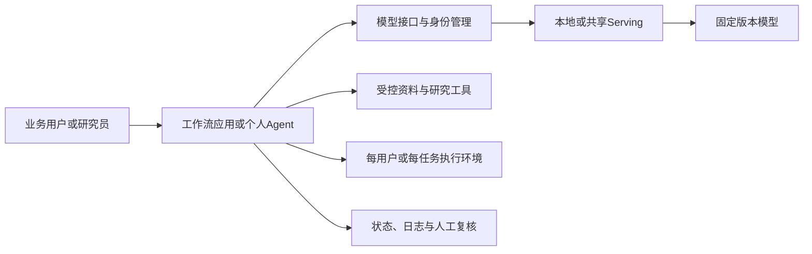

# Harness调研：业务工作流与通用Agent运行环境

**核查日期：**2026年9月17日。  
**范围：**LangChain/LangGraph、Dify及相关工作流框架；OpenCode、pi、DeepSeek Harness、Codex CLI、Claude Code，并补充Deep Agents。  
**配套：**[Serving framework调研](serving-framework-survey-2026-09-17.md)、[模型候选](../models/model-survey-2026-09-16.md)、[模型许可](../models/license-review-2026-09-16.md)。

本轮完成官方文档、许可、版本、配置及部分代码核查，没有安装平台或运行Agent。本地只读取了已安装Codex CLI的帮助、README与包版本，没有读取凭证或修改配置。全文将“有接入方法”“具备功能”“官方支持”“实际可靠运行”分别记录。

## 1. 主要结论

1. **业务工作流优先比较Dify与LangGraph。** Dify适合应用搭建、知识库和业务人员协作；LangGraph适合工程团队掌握状态、分支、人工审核与恢复逻辑。二者不是同层产品。
2. **通用个人Agent先比较OpenCode与pi。** 前者提供较完整产品体验，后者适合透明、可修改的最小运行底座。都已有自托管provider配置入口，不需要先维护源码分支。
3. **Codex CLI保留核心比较，但先做Responses兼容性验证。** CLI是Apache 2.0开源项目；当前provider配置使用Responses协议，仅有Chat Completions接口不够。
4. **DeepSeek Harness值得深入，但目前是开发者预览。** 插件化程度高，自托管模型配置明确；上游明确说明尚不能视为secure或production-ready，适合独立技术验证。
5. **Claude Code需要纠正“本质开源”的前提。** 当前公开仓库许可为保留所有权利、使用受商业条款约束。SGLang等确有接入它的技术文档，但Anthropic明确不支持经gateway路由到非Claude模型。技术可连接、许可可修改和厂商支持不是同一个结论。
6. **LangChain不能只按早期版本印象排除。** 现在应区分LangChain组件/agent层、LangGraph运行时、Deep Agents完整harness与LangSmith商业平台。

以上为本项目研究判断。最终组合还取决于业务协作方式、代码维护责任及目标模型的工具使用能力，不把厂商“production-ready”描述当成本项目验收结果。

## 2. 工作流与通用harness的差别

| 维度 | 业务工作流 | 通用Agent harness |
|---|---|---|
| 谁决定流程 | 工程师/业务人员先定义大部分节点、条件与审核点 | 模型根据任务和工具结果决定较多后续动作 |
| 典型任务 | 公告提取、证据检索、材料预审、标准化报告 | 探索资料、写代码、跨文件修改、调用研究工具完成开放任务 |
| 核心状态 | 业务对象、节点输出、执行状态与审核记录 | 会话、计划、工具调用、文件、上下文与任务历史 |
| 失败处理 | 节点重试、分支、恢复、幂等业务操作 | 模型修正、工具错误反馈、上下文压缩、循环和预算限制 |
| 产品形态 | Python库、服务后端或可视化协作平台 | CLI、桌面/Web客户端、SDK或agent运行服务 |

两类可以组合。例如LangGraph控制一个审核流程，其中某个节点调用有工具权限的Agent。调用之前应明确输入输出和停止条件，避免在一个简单提取任务中引入无边界的自主循环。

## 3. 工作流类：框架与平台比较

### 3.1 总表

| 项目 | 类型与本地接入 | 长处 | 需要承担的工作 | 许可/来源 |
|---|---|---|---|---|
| LangChain | 模型/工具集成和较高层agent抽象；可配置自托管模型连接 | 快速组合现成组件 | 版本与集成选择、测试；框架本身不提供完整企业后台 | MIT，[TECH-028](../sources/TECH-028/original.md) |
| LangGraph | 代码定义状态图与持久运行时；可独立于LangChain使用 | 检查点、流式执行、人工中断、确定性与agent节点混合 | 状态库、API/UI、身份权限、作业与运行管理 | MIT，[TECH-029](../sources/TECH-029/overview.md) |
| Dify | 可视化LLM应用平台，工作流/RAG/agent及模型管理；支持自托管模型连接 | 非工程人员参与搭建，应用发布与运行记录较完整 | 平台升级、数据库/缓存/沙箱/插件维护、企业功能与workspace设计 | 修改版Apache附加条件，[TECH-030](../sources/TECH-030/original.md) |
| Haystack | 检索、生成、工具与agent的显式组件/pipeline | 文档问答和可检查的检索流程；支持同步/异步及流式 | 应用UI、鉴权、持久状态和运维；企业平台另评 | Apache 2.0，[TECH-032](../sources/TECH-032/original.md) |
| LlamaIndex | 文档、索引、检索和工作流工具，支持非OpenAI/本地模型 | 文档处理与RAG组件 | 区分OSS组件与LlamaParse/LlamaCloud；确认维护及数据处理位置 | MIT库，[TECH-031](../sources/TECH-031/original.md) |
| Flowise | 可视化Agent/Chatflow搭建平台 | 面向应用原型与流程搭建的另一选择 | 平台运行、模型连接、具体企业能力及对应许可 | 普通部分Apache 2.0，指定企业部分商业许可，[TECH-033](../sources/TECH-033/LICENSE) |
| n8n | 业务系统集成与自动化平台，可加入模型/agent节点 | 数据流、触发器及已有业务应用连接 | 凭证、任务执行、外部连接、运行边界；不宜当纯模型harness来比较 | Sustainable Use及企业许可，[TECH-034](../sources/TECH-034/LICENSE) |

### 3.2 LangChain / LangGraph：重点看当前分层

官方现在将LangChain作为模型、工具和agent抽象，将LangGraph作为状态运行时；Deep Agents在其上增加完整harness能力。[LangChain overview](../sources/TECH-028/overview.md)、[LangGraph overview](../sources/TECH-029/overview.md)。本轮包索引为LangChain 1.4.1、LangGraph 1.2.11；GitHub monorepo的latest release可能属于core或SDK子包，不能直接当作主库版本。

对本项目，更值得比较的是LangGraph能否清楚表达“取资料、结构化处理、检查证据、人工复核、保存结果”，并在失败后正确恢复。[Durable execution](../sources/TECH-029/durable-execution.md)与[interrupts](../sources/TECH-029/interrupts.md)是直接相关文档。

**取舍：**需要团队编写和维护应用，但业务规则、状态与变更更容易通过代码审阅。恢复时可能重放节点逻辑，外部写操作应设计成幂等或采用任务边界；持久化并不自动保证每个业务副作用恰好执行一次。核心库能本地使用，LangSmith云服务、企业部署产品及其许可/数据路径另行判断。

### 3.3 Dify：适合应用平台，但有实际运营与许可成本

当前Dify同时包括工作流、知识库、agent、模型管理和观测集成，不只是一个RAG界面。[README](../sources/TECH-030/original.md)。官方[部署文档](../sources/TECH-030/deployment.md)列出应用、worker、插件、agent服务及数据库、缓存、代理、沙箱等组件。文档最低启动资源不含所选本地大模型的GPU需求，也不能直接当成几十人生产服务配置。

**适合的用途：**研究资料问答、事件提取服务、合规预审等有清楚流程的内部应用，尤其当业务人员需要参与修改或发布时。研究应区分模型连接、检索组件、平台状态与工具沙箱，安排升级、备份及恢复责任。

**许可重点：**[LICENSE](../sources/TECH-030/LICENSE)允许商业使用，但对未经书面授权的多租户运行和使用前端时删除/修改标识设有额外限制，且明确一个tenant对应一个workspace。几十个员工共享一个workspace与按部门开多个workspace不能混为一谈。是否需要商业授权取决于实际组织设计，不由“仅内部用”自动豁免。

本轮取得的模型管理网页是Dify Cloud文档，不能将其付费、角色或provider规则直接套到自托管版。自托管功能按repo、所选版本及实际插件核对；SSO、审计或部门隔离等要求需要逐项确认版本与授权范围。

### 3.4 Haystack、LlamaIndex、Flowise、n8n如何取舍

**Haystack**适合把检索、排序、过滤和生成拆成可测试pipeline。当前README还说明Hayhooks可将pipeline/agent暴露为HTTP或MCP。对于本项目的固定金融文本任务，它是LangGraph之外值得保留的工程框架对照；无需为了简单pipeline强行引入复杂agent状态机。

**LlamaIndex**的当前README明确表示团队重点转向LlamaParse、LiteParse和文档评测，同时保留OSS框架。研究应依据具体模块的维护情况选择，而不是沿用“最主流RAG框架”的旧印象。托管解析或索引服务与纯本地组件分别检查，不自动启用云依赖。

**Flowise**作为Dify的可视化对照保留。其根LICENSE对企业目录及指定文件有商业许可例外，因此必须检查实际会使用的组件，不能只按README一句Apache概括整个平台。

**n8n**更适合连接邮件、工单、资料入库等业务流程。其Sustainable Use License允许相应内部业务用途，但并非普通MIT/Apache；对外提供服务、分发及企业文件有额外边界。本阶段可用于业务集成比较，暂不让它承担模型服务或完整代码Agent的所有职责。

## 4. 通用Agent harness比较

### 4.1 总表

| 项目 | 形态与扩展方式 | 自托管模型接入 | 权限与状态重点 | 本项目判断 |
|---|---|---|---|---|
| OpenCode | 开源CLI/服务/应用，配置provider、工具与agent | 官方支持自定义baseURL及本地provider，常用Chat Completions路径 | 会话、工具权限、模型/上下文配置；应用权限不等于OS隔离 | 完整个人Agent的首轮候选 |
| pi | 精简coding-agent、agent-core及多provider层；CLI、RPC、SDK | `models.json`可选Chat、Responses、Anthropic等协议 | 会话树、上下文压缩；默认有宿主权限，隔离/审批按需求外接 | 可控可改的研究底座首轮候选 |
| DeepSeek Harness | Cordis插件组合，loop/模型/工具/存储/UI可替换 | 当前文档支持自托管URL与三类协议，无需绑定DeepSeek模型 | 插件版本、会话、审批和沙箱的实际执行能力 | 开发者预览，单独试验与跟踪 |
| Codex CLI | Apache 2.0的本地coding agent，可配置或修改CLI | 自定义provider；当前配置协议为Responses | 工具/沙箱/会话与上下文，精确Responses兼容性 | 协议符合时进入重点比较 |
| Claude Code | 商业coding agent；公开仓库不等于核心开源许可 | 社区/引擎侧存在Messages适配；Anthropic不支持非Claude模型路由 | 技术适配、商业条款与支持边界 | 保留对照，不能写成可自由fork的生产主线 |
| Deep Agents | LangGraph上的完整harness库及终端工具 | 官方支持具备工具调用的本地模型连接 | 规划、文件系统、上下文、子任务、检查点与人工审核 | 自建研究Agent的补充重点候选 |

来源分别为TECH-035–039、041，具体文档见下文。服务端支持多用户，不代表这些个人harness已经提供企业多租户平台；共享GPU推理与隔离的用户执行环境可以分开部署。

### 4.2 OpenCode

当前[provider文档](../sources/TECH-035/providers.mdx)直接提供自定义provider、baseURL及llama.cpp等本地连接方式。修改模型路由通常可以先通过配置完成；真正需要定制时再评估插件或源码扩展。MIT许可原件见[TECH-035/LICENSE](../sources/TECH-035/LICENSE)。

它适合作为个人工作站或连接集中GPU的交互Agent。研究重点是模型能力声明、工具格式、上下文限制、压缩和辅助调用是否都走目标端点，避免主模型已本地化而其他功能仍调用外部服务。

[权限文档](../sources/TECH-035/permissions.mdx)提供allow/ask/deny及规则配置，可限制工具行为。但Agent层规则和容器/操作系统边界分别评估，不能把“plan模式”或一组提示词当成完整隔离方案。具体默认值与策略优先级按部署版本固定。

### 4.3 pi

本轮核对的官方项目是`earendil-works/pi`，MIT，核心层包括pi-ai、pi-agent-core与coding-agent；旧文章的项目名、包名可能不同。[README](../sources/TECH-036/original.md)。

[models.json文档](../sources/TECH-036/models.md)支持`openai-completions`、`openai-responses`、`anthropic-messages`等API类型，以及developer role、reasoning参数等兼容开关。这个透明度有利于本项目固定协议与做harness对照。

[coding-agent文档](../sources/TECH-036/coding-agent.md)提供会话树、压缩、RPC和SDK，同时明确默认不内建MCP、子agent或权限弹窗；这些可通过扩展实现。[容器文档](../sources/TECH-036/containerization.md)明确默认使用全部可用权限，并说明多种隔离方式。

**研究判断：**适合想自己掌握工具、状态和模型连接的工程团队。低层透明度以自建平台能力为代价，不能把精简核心直接等同于全套企业应用。对实验，先用固定少量工具和外部执行隔离，避免一开始叠加大量社区扩展。

### 4.4 DeepSeek Harness

官方`deepseek-ai/deepseek-harness`以Cordis组合插件，模型adapter、工具、会话日志、agent loop等均可替换。[架构](../sources/TECH-037/architecture.md)。它是完整运行环境，不能与DeepSeek API SDK或第三方同名项目混淆。

[模型配置文档](../sources/TECH-037/providers.md)提供自定义公司gateway/自托管服务，协议可选Chat Completions、Responses和Anthropic Messages；说明其并不要求只能使用DeepSeek模型。

**当前限制是成熟度。** [README](../sources/TECH-037/original.md)与[Safety](../sources/TECH-037/safety.md)明确developer preview、可能破坏兼容、未安全审计且不应视为production-ready。[沙箱文档](../sources/TECH-037/sandbox.md)还区分文件系统约束、平台partial enforcement与其他隔离能力。

**研究判断：**插件化与模型适配值得深入；先固定commit，在公开材料和隔离工具环境中评价。现阶段不把它直接列为全办公室默认生产harness。MIT许可与可替换性不自动解决运行风险或升级兼容问题。

### 4.5 Codex CLI

本轮使用OpenAI Docs技能核对官方配置文档，并检查已安装CLI帮助。开源对象是`openai/codex`的CLI代码，Apache 2.0；不能据此把OpenAI模型、托管服务或桌面产品的全部组成都称为同一许可。[仓库许可](../sources/TECH-038/LICENSE)。

官方[advanced configuration](https://learn.chatgpt.com/docs/config-file/config-advanced)支持自定义provider，配置base URL、认证、请求头等；也提供Ollama/LM Studio本地模式。[配置参考](https://learn.chatgpt.com/docs/config-file/config-reference)当前规定`wire_api`仅支持`responses`。[本地文档快照](../sources/TECH-038/config-advanced.md)、[字段参考](../sources/TECH-038/config-reference.md)。

**研究判断：**应先用正常provider配置连接支持Responses的自托管端点，而不是一开始fork CLI。联调需检查SSE事件、工具调用及回传、reasoning item、上下文压缩、取消和重试。提供`/v1/responses`路由只是起点，不保证所有请求或状态语义都匹配。

若后端只有Chat Completions，有三种可比较方案：选择Chat原生harness；提供维护中的协议适配；修改开源CLI。后两项会增加兼容测试与升级成本，不应仅以“改base URL”估算。

当前本机包为0.149.1，归档的GitHub最新正式release为0.154.0，官方在线文档及源码HEAD另有时间点；本次未升级或运行任何模型。实际PoC需要以选定CLI构建为准。

### 4.6 Claude Code

[官方repo LICENSE](https://github.com/anthropics/claude-code/blob/main/LICENSE.md)当前写明保留所有权利，使用受Anthropic商业条款约束。公开issues、插件、文档或可查看的代码，不提供等同MIT/Apache的核心fork授权。[本地许可](../sources/TECH-039/LICENSE)。

技术上，本轮确实找到[SGLang的Anthropic兼容接口文档](../sources/TECH-021/anthropic-api.md)及llama.cpp Messages接口，它们描述了将Claude Code指向自托管端点的路径。另一方面，Anthropic的[官方gateway文档](https://code.claude.com/docs/en/llm-gateway)明确不支持通过gateway将Claude Code路由到非Claude模型。[归档](../sources/TECH-039/llm-gateway.md)。两类证据分别说明技术适配与厂商支持边界，不能互相替代。

因此，**不能说接自托管模型技术上绝对不可行，也不能将其包装成Anthropic支持的开源改造方案。** 若保留技术对照，需要核对部署时适用条款、升级回归与功能差异。本阶段的默认自托管harness优先从正常开放许可和原生provider路线选择。

官方“第三方平台”也主要涉及通过相应云平台使用Claude，不能据该词自动推导为任意开放权重模型获得支持。[企业部署文档](../sources/TECH-039/third-party.md)。

### 4.7 Deep Agents

作为补充，LangChain的[Deep Agents](https://github.com/langchain-ai/deepagents)当前明确定位为完整agent harness，基于LangGraph，提供规划、文件系统、上下文管理、子任务、工具和人工审核，支持自托管工具调用模型。[TECH-041](../sources/TECH-041/original.md)。

它连接了本次两类需求：团队可保留工作流状态控制，同时在限定节点中引入通用Agent能力。适合自建研究助手，与OpenCode/pi的开箱即用个人工具分别比较。核心MIT库与LangSmith商业观测/部署产品仍需分开记录；工具能做什么由实际执行边界控制。

## 5. 自托管接入矩阵

| Harness | 优先协议/接法 | 是否先改源码 | 首轮必须验证的差异 |
|---|---|---|---|
| LangGraph / LangChain | 指定model adapter或自行实现调用层 | 通常无需 | 调用状态、流式工具、schema与重试 |
| Dify / Flowise | 对应provider连接和平台配置 | 通常先用配置/支持的扩展 | 模型能力声明、工具/agent节点、embedding及其他外部组件 |
| Haystack / LlamaIndex | 对应generator/LLM adapter、本地端点 | 通常无需 | 文档与检索链、数值输出、异步错误 |
| OpenCode | 自定义provider，常用Chat Completions | 通常无需 | tool schema、上下文与压缩、辅助调用路由 |
| pi | 显式选择Chat / Responses / Messages | 通常无需 | provider兼容开关、reasoning回传、上下文及扩展 |
| DeepSeek Harness | 自定义provider的三协议之一 | 通常无需 | 插件版本、会话固定模型、工具和协议字段 |
| Codex CLI | 自定义Responses provider | 完整兼容端点可先配置 | streaming事件、工具结果、状态/压缩与请求参数 |
| Claude Code | Anthropic Messages技术适配 | 不能视为自由修改核心源码的开源路线 | 厂商不支持非Claude路由；技术兼容及适用条款分别审查 |
| Deep Agents | LangChain模型连接或自定义adapter | 通常无需 | middleware、子任务、文件系统及checkpoint行为 |

路由变更后，仍要逐项检查模型chat template、工具名称、参数schema、并行call ID、reasoning输出、停止标记、图像内容和token统计。工具调用能力差的模型不能靠兼容API自动补齐。

## 6. MSIM两类部署的组合建议

这是参考设计，不是已部署架构。模型推理服务处理token，harness管理任务，研究工具负责数据/代码操作，用户身份和执行环境贯穿调用链。

| 目标 | 建议先比较的组合 | 决定性问题 |
|---|---|---|
| 个人研究与代码助手 | OpenCode或pi + 四个专业个人机模型 + 合适的MLX/llama.cpp/GPU服务 | 日常任务成功率、端点兼容、长会话、权限与维护 |
| 个人Codex体验与自托管模型 | Codex CLI + 已验证Responses端点 | 是否能完成真实多轮工具任务，是否需持续适配 |
| 面向几十人的内部资料/提取应用 | Dify + vLLM/SGLang共享模型 | workspace与许可、资料权限、运行组件和用户体验 |
| 工程团队控制的审批/研究流程 | LangGraph或Haystack + 模型服务 + 固定研究工具 | 状态和错误可追溯、人工复核、重试幂等与运维 |
| 开放式研究Agent的定制探索 | pi或Deep Agents；DeepSeek Harness另列预览实验 | 工具能力、任务预算、隔离、长期维护及升级 |

共享推理不应默认意味着所有用户共享一个shell、会话目录或检索身份。个人机运行也要明确资料、日志和工具输出的位置。现有内部系统可承担身份与记录功能，是否新增组件按实际缺口决定。

## 7. Harness评价方法：固定模型后比较整个任务

同一个模型在不同harness中，系统提示、工具定义、上下文管理、重试和任务分解都可能不同。需要同时记录这些差异及最终任务结果，不能把改变harness后的分数全部归给模型。

| 测试组 | 任务示例 | 记录指标 |
|---|---|---|
| 固定流程 | 公告提取、带证据问答、材料复核 | 任务正确率、引用支持、schema成功、人工修改时间 |
| 多步只读研究 | 读取多份材料、查询限定数据、核对并形成结论 | 工具选择、参数、错误恢复、证据完整性 |
| 代码辅助 | 在隔离的公开/合成项目中修复有验收条件的小问题 | 验收通过、无关修改、工具步数、时间与资源 |
| 长会话 | 追加材料、压缩历史、恢复任务 | 信息保持、状态恢复、重复工作、上下文超限处理 |
| 故障与权限 | 超时、工具失败、拒绝的路径/写操作 | 合理停止、重试上限、是否重复副作用、记录完整性 |

至少分三层测量：

1. **协议检查：**先用固定输入核对streaming、schema、tool call/result和取消。必要时可用模拟端点验证harness请求形状，但模拟不能证明模型或整条业务链有效。
2. **固定工具轨迹回放：**向同一模型/引擎发送一致轨迹，比较服务成本；固定工具返回时间，减少外部系统波动。
3. **真实任务对照：**允许harness正常规划与恢复，使用相同模型、资料、工具权限和预算，评价最后产物。记录token、调用数、失败、人工介入及端到端时间。

初轮只选少量候选进入实测：工作流侧Dify与LangGraph/Haystack按任务取两项；通用侧OpenCode、pi和条件满足时的Codex。DeepSeek Harness单列预览验证，Deep Agents用于确有自建研究Agent需求的扩展。先完成总计划的一模型PoC，再扩大组合数量。

## 8. 许可与维护检查结果

| 类别 | 项目 | 需要保留的区别 |
|---|---|---|
| 标准MIT/Apache核心 | LangChain、LangGraph、Haystack、LlamaIndex、OpenCode、pi、DeepSeek Harness、Codex CLI、Deep Agents | 仍需逐组件核对；云平台、商业服务、模型权重和第三方插件不自动继承核心许可 |
| 带明确附加条件的平台 | Dify、Flowise、n8n | 多workspace、企业组件、前端标识、内部/对外用途可能改变授权条件 |
| 商业核心产品 | Claude Code | 不能以公开GitHub仓库或兼容协议推定可自由修改和再分发 |

维护记录按版本与组件判断。LangChain/LangGraph monorepo的latest release不一定是主库；pi的当前repo与旧名称不同；DeepSeek没有latest-release记录且明确developer preview。上述事实用于版本管理，不以星数直接排序成熟度。

## 9. 来源与本轮交付

工作流来源为TECH-028–034，通用harness为TECH-035–039、041。OpenAI配置来自官方文档及已安装CLI的只读检查；Claude Code使用官方许可和gateway文档，并与SGLang的技术接入说明对照。各来源目录保存README、LICENSE、commit、release及所读专题文档，URL和SHA-256见metadata。

结论已具备选择少量PoC组合的依据。实际安装、模型接入、企业授权适用性和任务benchmark仍未执行；本轮没有联系厂商、接受协议、修改系统设置或调用付费模型。
