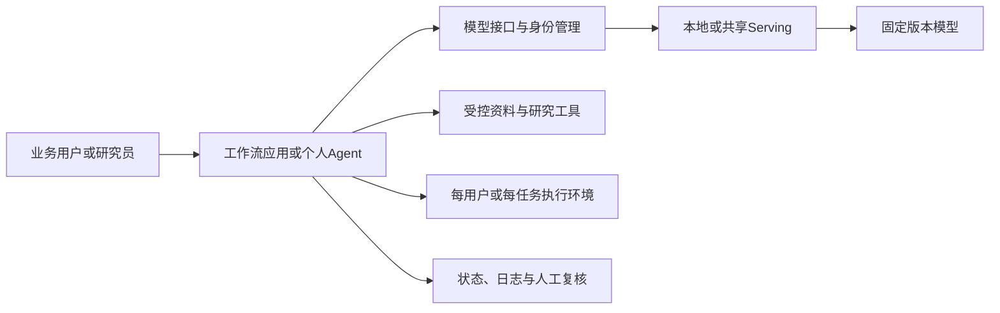

# Harness与AI应用调研：它们能帮基金公司完成什么工作

**更新日期：**2026年9月18日。文件路径沿用9月17日版本，便于原链接持续有效。

**修改前检查点：**`9e5c2fe`。

**阅读方式：**第1–8节介绍产品、优点及业务用途；许可、接入与测试细节放在后面。

**配套：**[Serving调研](serving-framework-survey-2026-09-17.md)、[模型候选](../models/model-survey-2026-09-16.md)、[参考架构](reference-architecture.md)。

本轮补查非coding应用的官方产品文档、当前仓库、发布状态与许可。下面的基金业务例子是本项目提出的用法，不是供应商已在MSIM落地的案例，也没有借用供应商宣传数字作为预期收益。本轮未安装或实测产品。

## 1. 先说明我们在选择什么

模型部署完成后，同事还需要一个地方提问、上传资料、保存工作结果，并在需要时让模型查询数据、处理文件或执行流程。这里的软件决定了同事最终得到的是一个聊天窗口、一个知识检索助手，还是能够持续完成任务的助手。

狭义的**harness**负责把模型调用、工具使用和任务状态组织起来。实际选型还要看包含这些能力的完整应用：员工不一定需要自己操作harness的底层接口。上一版侧重开发框架和编码Agent，低估了这类现成工作台与非coding助手。

“非coding”描述的是用户的工作。研究员让助手整理表格、画图、比较财报时，助手内部仍可能执行代码；评价重点应是得到的材料是否准确、可核对、可继续使用，而不是界面有没有终端。

## 2. 给mentor的用途总览

| 希望同事能够做什么 | 软件类型 | 重点项目 | 主要价值 |
|---|---|---|---|
| 用内部模型聊天、读文件、整理初稿 | 员工AI工作台 | Open WebUI、LibreChat、AnythingLLM | 提供现成入口，减少每个人独立配置模型和工具的负担 |
| 从大量分散资料中找依据、回答问题、形成研究材料 | 企业知识与资料研究平台 | Onyx、RAGFlow | 把资料接入、检索和引用核查组织成完整工作 |
| 按固定步骤处理公告、材料预审或运营任务 | 可视化应用与自动化平台 | Dify、Flowise、n8n | 将一次有效的方法做成可重复使用的业务流程 |
| 交给助手一个目标，让它读取文件、调用工具并交付结果 | 通用任务助手 | Goose、OpenClaw；定制时考虑Deep Agents | 减少用户在聊天、文件、查询和计算工具间反复切换 |
| 按部门系统和业务规则建设专用助手 | Agent开发框架 | LangGraph、Microsoft Agent Framework、Agno、CrewAI | 更好地控制业务逻辑、工具、状态和人工处理环节 |

这些类别有重叠，不能只按“支持Agent/RAG”判断优劣。例如，LibreChat也能调用工具，Dify也能做知识问答；应比较它们完成同一工作时的体验与建设成本。

## 3. 员工AI工作台：先让模型成为能用的日常工具

### 3.1 Open WebUI：公司内部统一的AI入口

**做什么：**提供自托管的聊天工作台，让员工选择模型、上传文件、使用知识库，并通过配置好的工具完成更多操作。它能连接Ollama和OpenAI兼容模型服务，包括自建GPU服务。[官方项目](https://github.com/open-webui/open-webui)、[功能资料](../sources/TECH-043/features.md)。

**主要优点：**

- 同事通过浏览器使用，后台模型和服务位置可以集中管理。
- 文档问答、共享工具及角色/用户组管理已有产品入口，基础应用建设量较小。
- 可以先用于阅读和写作，再逐步加入工具与专用助手。

**基金业务用法：**研究员上传公开财报，要求整理业务变化并标出依据；运营或合规同事在允许的制度资料范围内查询问题。

**选择边界：**浏览器工作台不自动具备可靠的长任务执行环境。文件处理、代码运行和数据权限需要按所选功能配置。当前Open WebUI许可有品牌保留条款及特定例外，详见第9节；不能简单记为普通MIT。

### 3.2 LibreChat：把聊天、文件分析和可复用助手放在一起

**做什么：**提供可自托管的多模型工作台，用户可以配置带资料、工具与Skills的专用Agent，并共享给同事。当前文档还覆盖文件搜索、代码执行、生成文件和任务状态。[官方项目](https://github.com/danny-avila/LibreChat)、[Agents](../sources/TECH-044/agents.md)。

**主要优点：**

- 同事可以在熟悉的聊天界面里完成资料阅读和工具操作，不必先学编码终端。
- 一个常用助手的指令、资料和工具可以保存，减少每次重新解释工作要求。
- 文件可从上传、分析到下载结果形成连续体验，适合表格和材料整理。

**基金业务用法：**上传公开财务CSV，让助手计算变化、生成图表与说明，再下载结果；或把多份公告整理成带来源的比较表。计算和文件生成依赖实际配置的执行服务。

**本轮更新：**官方[Code Interpreter文档](../sources/TECH-044/code-interpreter.md)已说明可自托管的代码执行服务；不能沿用“只能用托管代码解释器”的旧印象。但stateful sessions和attached workspaces被明确标为高度实验性，不能将这些新功能与成熟聊天功能作同一可靠性判断。

### 3.3 AnythingLLM：个人资料助手的整合方案

**做什么：**把模型连接、资料导入、文档聊天及Agent能力放进一个应用，提供桌面和自托管部署路线。[TECH-053](../sources/TECH-053/original.md)。

**主要优点：**

- 对个人机试用较友好，资料、工作空间和模型入口相对集中。
- 可以先做“自己的资料助手”，再使用可视化Agent Flow扩展重复任务。
- 支持来源引用及多种本地/云模型，便于替换后台服务。

**基金业务用法：**围绕一个行业或项目建立资料工作空间，持续积累公告与公开报告，用于问答、要点整理和草稿写作。

**选择边界：**当前README明确多人及权限功能属于Docker路线，不能把个人桌面版直接等同于部门平台。其“Open Computer”仍以在开发的能力介绍，本轮不把它计入已稳定可用功能。Core MIT与Desktop Pro/托管产品分别判断。

## 4. 企业知识与资料研究：重点是能找到、看懂并引用材料

### 4.1 Onyx：连接企业资料的搜索与研究助手

**做什么：**连接已有信息源，提供搜索、问答、Agent、多步研究及文件产物。其完整部署包含索引与检索组件，也提供功能较轻的Lite模式。[官方项目](https://github.com/onyx-dot-app/onyx)、[产品说明](../sources/TECH-045/welcome.md)。

**主要优点：**

- 从分散资料中检索证据，减少用户逐个平台寻找信息。
- 将搜索、问答和多步研究放在同一入口，适合围绕一个问题持续追查。
- 提供企业管理与连接器路线，值得作为几十人共享研究平台的候选。

**基金业务用法：**围绕某家公司或行业，检索授权材料、比较不同时间的观点，并输出带证据的研究简报。连接实际内部资料库仍需相应连接器和权限配置。

**选择边界：**资料源的权限继承比界面是否能聊天更关键。Community与Enterprise功能必须按实际版本核对；根许可对`ee`目录设有企业例外。当前[产品版本页面](../sources/TECH-045/pricing-features.md)也区分权限、SSO及企业部署能力，不能把全部功能都归入免费版。

### 4.2 RAGFlow：让复杂文档成为可查询的资料

**做什么：**重点处理文档解析、切分、索引和带引用的回答，并将检索与Agent流程结合。[官方项目](https://github.com/infiniflow/ragflow)、[原文归档](../sources/TECH-046/original.md)。

**主要优点：**

- 关注复杂文档的内容理解和检索依据，适合大量PDF、表格与长报告。
- 能查看与核对引用，使答案较容易回到原始材料检查。
- 资料处理可独立优化，再供问答或其他Agent使用。

**基金业务用法：**建立公开财报、公告或制度资料库，检索财务口径、条款和历史变化；重点评测跨页表格、注释、单位和时点是否正确。

**选择边界：**强项是资料基础，不应仅凭支持Agent就把它当成所有办公工作的通用助手。复杂表格质量需要实际样本验证。代码执行组件需要[单独沙箱配置](../sources/TECH-046/sandbox.md)，自托管主应用不意味着解析、模型和工具全部自动在本地。

## 5. 固定业务流程：把一次有效操作变成可重复的应用

### 5.1 Dify：把模型能力做成部门可以反复使用的业务应用

**做什么：**用可视化界面串联资料、模型、判断条件与工具，发布成聊天助手或工作流应用。[TECH-030](../sources/TECH-030/original.md)。

**主要优点：**流程可见，业务人员更容易参与讨论和修改；知识库、模型管理、应用入口及运行记录已经集中在平台内。

**基金业务用法：**把“接收公告、提取事件、核对字段、列出待复核问题、输出统一表格”做成固定应用；或按明确审核项生成营销材料预审意见。

**选择边界：**适合流程已经比较清楚的工作。复杂企业系统接入仍需要工程支持；一个workspace与多个workspace涉及不同许可问题。相比直接使用聊天工作台，Dify的优势主要在于把过程固化和复用。

### 5.2 n8n：连接现有系统，把重复事务自动串起来

**做什么：**通过触发器和连接器，把资料来源、业务系统、人工确认与模型处理串成流程。[TECH-034](../sources/TECH-034/original.md)。

**主要优点：**擅长跨系统自动化，模型只需参与需要语言理解的步骤；适合已有清楚输入、输出和处理规则的事务。

**基金业务用法：**发现新增公开公告后下载、交给模型分类、保存到指定目录并形成待阅清单。这是拟议工作流，本轮没有设置监控或发送消息。

**选择边界：**它的核心价值是业务连接与流程执行，不是自身提供更强推理。采用内部连接器的可行性和Sustainable Use/企业授权分别核对。

### 5.3 Flowise：可视化搭建AI助手的另一条路线

**做什么：**提供Chatflow/Agentflow的可视化构建方式，连接模型、资料和工具。[TECH-033](../sources/TECH-033/original.md)。

**主要优点：**便于展示和调整组件之间的关系，可以较快试验不同助手流程，适合作为Dify的同任务对照。

**基金业务用法：**搭建范围明确的产品资料助手，或展示检索、回答和复核环节怎样连接。

**选择边界：**不能仅凭画布相似判断与Dify功能等价。企业目录及指定文件适用商业许可，身份和团队功能需具体检查。

## 6. 通用任务助手：用户描述目标，助手组织操作

### 6.1 Goose：能在电脑上处理研究、写作和文件工作的助手

**做什么：**提供桌面应用、CLI和API，通过模型与工具完成研究、写作、自动化和数据分析。原`block/goose`已跳转至`aaif-goose/goose`。[官方项目](https://github.com/aaif-goose/goose)。

**主要优点：**

- 有桌面入口，非技术同事不必以编码终端为主要交互方式。
- 可以通过工具扩展访问文件、数据和应用，适合一个任务横跨多个工具。
- [Recipes](../sources/TECH-047/recipes.md)把已经验证的指令、扩展与设置保存下来，方便团队复用。
- 支持[自定义模型服务](../sources/TECH-047/providers.md)，可以连接内部推理端点。

**基金业务用法：**读取一组公开公告，整理事件表，再调用计算或文件工具生成简报；或把常见数据整理方法保存为可复用任务。

**选择边界：**任务能否完成仍取决于所装工具和模型。桌面能运行不等于可以自动操作全部内部系统。Goose的Apache 2.0核心与第三方扩展分别审阅；它应进入非coding个人助手的重点比较。

### 6.2 OpenClaw：有持续记忆和多入口的个人助手

**做什么：**以自托管Gateway连接模型、会话、记忆、工具和消息入口，使助手能够持续处理个人任务。[产品说明](../sources/TECH-048/product-overview.md)、[本地模型配置](../sources/TECH-048/local-models.md)。

**主要优点：**任务可以延续到多次对话，适合有持续背景的个人工作；可从用户常用入口访问，并按需要扩展工具和定时工作。

**基金业务用法：**为某位研究员维护关注主题与资料整理流程，按授权范围准备待阅材料或会议资料。常驻任务是候选用途，本轮没有实际启用。

**选择边界：**[官方信任模型](../sources/TECH-048/trust-model.md)以一个Gateway对应单一信任边界为基础，不能直接把个人助手配置开放给需要严格隔离的全公司用户。其长处是持续个人任务；多人企业平台要另做身份、资料与执行边界设计。MIT许可不替代这些产品条件。

### 6.3 Deep Agents：帮助工程团队开发“能持续做事”的研究助手

**做什么：**在LangGraph之上提供规划、文件工具、上下文管理、子任务和人工介入等常用能力。[TECH-041](../sources/TECH-041/original.md)。

**主要优点：**团队可以直接复用多步任务需要的基础能力，把精力放在研究工具、资料和交付格式上；已有LangGraph流程也较容易组合进来。

**基金业务用法：**开发一项专门的研究任务：围绕问题检索资料、列出证据缺口、调用数据工具，最后生成有出处的简报。

**选择边界：**这是开发底座，仍要建设用户界面和业务工具。适合团队愿意自建专用助手时使用；不能与现成员工工作台按安装时间直接排名。

### 6.4 DeepSeek Harness：可以自由组合能力的通用Agent底座

**做什么：**将模型、工具、会话、执行循环、存储和界面组合成可替换的插件，提供Web等使用方式。[TECH-037](../sources/TECH-037/original.md)。

**主要优点：**定制空间大，模型与工具连接可替换，适合研究不同Agent工作方式和构建专用能力。

**基金业务用法：**作为研究环境试验不同资料工具、任务组织方式和输出形式。

**选择边界：**当前官方仍明确标为developer preview，并在[Safety](../sources/TECH-037/safety.md)中说明不应视为production-ready。保留技术探索价值，默认办公室应用应优先选择有更明确运行与维护条件的路线。

## 7. 需要自己开发应用时，框架分别擅长什么

| 项目 | 用易懂的话说明它做什么 | 主要优点 | 适合本项目的工作 |
|---|---|---|---|
| LangGraph | 把AI参与的工作画成可执行的步骤和分支，并记录进度 | 过程可控制，能暂停等人审核，也能从中断处恢复 | 固定审核流程与包含开放研究步骤的混合任务 |
| Microsoft Agent Framework | 为.NET/Python团队提供统一的Agent与流程开发基础 | 多模型与工具接口、人工处理及企业应用整合路线较完整 | 与现有业务系统连接的部门专用助手 |
| Agno | 帮团队开发助手、让它们提供服务，并管理记忆、知识与运行记录 | Agent、协作团队和workflow集中在同一产品路线 | 长期维护的内部研究助手与多个专用助手 |
| CrewAI | 将任务分给不同职责的Agent，并用Flow控制整体过程 | 工作分工直观，可把资料搜集、核对、写作分开组织 | 有明确分工和可独立验收子任务的研究流程 |
| Haystack | 将文档检索、排序、过滤和回答组成可检查的处理流程 | 适合认真评测资料找到得对不对、回答依据够不够 | 制度问答、财报检索与固定文档处理 |
| LlamaIndex | 提供把文档整理成模型可用资料的组件与工作流 | 文档接入、解析、索引等资料基础能力 | 复杂资料接入及已有应用的检索层 |
| LangChain | 提供连接模型、工具和常见Agent行为的组件 | 现成集成多，适合作为开发应用的配套 | 给上述流程接入模型和工具 |

**Microsoft Agent Framework的新进展：**[微软官方](../sources/TECH-049/build-update.md)说明MAF已于2026年4月达到1.0 GA；[AutoGen当前README](../sources/TECH-050/original.md)明确进入maintenance mode，并建议新项目使用MAF。继续把AutoGen当成新项目默认路线已不合适。MAF支持[Ollama/本地兼容端点](../sources/TECH-049/ollama.md)，不意味着必须把推理放到Azure，也不意味着所有云端托管工具都能随之本地化。

**Agno的新进展：**当前官方区分SDK、AgentOS运行时和Control Plane管理界面。[产品分层](../sources/TECH-051/overview.md)。其核心仓库当前为Apache 2.0；[商业版本](../sources/TECH-051/pricing.md)对管理与自托管Control Plane另作区分。不能把“核心库开放”直接解释为全部管理平台免费可自建。

**CrewAI的选择依据：**当前文档强调Flows控制工作过程、Crews承担协作任务。[官方概念](../sources/TECH-052/overview.md)。多Agent更容易表达业务分工，但也会增加调用和复核成本；只有子任务有明确价值时才采用，不能把Agent数量当能力指标。支持[本地模型配置](../sources/TECH-052/llms.md)仍需验证所选模型的工具能力。

LlamaIndex当前官方仍说明重心转向文档处理与LlamaParse等方向，OSS组件与托管产品分别研究。LangChain、LangGraph、Deep Agents也属于不同层次，不能按项目年龄简单淘汰。

## 8. 原有coding harness怎样向mentor介绍

| 项目 | 做什么、有什么优点 | 非coding工作的适用性 |
|---|---|---|
| OpenCode | 提供较完整的开源编码Agent，能阅读项目、修改文件、运行工具；模型连接可配置 | 技术研究员可借它处理资料和脚本；终端/研发取向不一定适合全部业务同事 |
| pi | 提供精简、容易扩展的Agent运行基础，便于团队掌握模型连接和工具行为 | 适合工程团队定制助手，业务用户界面和管理功能需要另建 |
| Codex CLI | 提供代码与文件任务、工具操作和任务管理能力，CLI核心采用Apache 2.0 | 可研究自托管模型接入，但当前Responses协议条件要满足 |
| Claude Code | 提供成熟的编码工作体验，可作为任务效果与交互参考 | 当前商业许可及非Claude模型支持边界使其不能按自由修改的开源核心处理 |

这些工具仍在比较范围内，但不再自动排在非coding员工助手的前面。此前的许可与协议结论保留，详细核对见附录与TECH-035–039。

## 9. 会改变实际选择的边界

| 产品 | 已核对的条件 | 对MSIM讨论的意义 |
|---|---|---|
| Open WebUI | 当前许可对品牌改动有限制；第4项有滚动30天不超过50名自然人等例外 | 这不是“超过50人就不能用”。要区分保留品牌使用与去品牌，并核对真实口径，不能预先套用例外 |
| LibreChat | 核心MIT；代码执行服务可自托管，但部分持久会话/附接环境高度实验性 | 先测试成熟功能，不能把全部新能力一起承诺为生产稳定功能 |
| Onyx | MIT核心与`ee`企业目录分开；权限继承、SSO等要按具体版本/商业方案确认 | 资料接入深度和权限管理可能比基础界面决定更多成本 |
| RAGFlow | 核心Apache 2.0；解析、embedding、模型与代码沙箱是不同处理环节 | 整个资料处理链的位置和质量需一起核对 |
| Dify | 多workspace与前端品牌存在附加许可条件 | 按部门隔离与集团共享方式可能改变授权方案 |
| AnythingLLM | 核心MIT；桌面、Docker多人及Pro/托管产品不是同一交付 | 先确定个人机还是部门共享，再选部署形态 |
| Goose / OpenClaw | 核心分别Apache 2.0 / MIT；扩展与所授权工具决定实际能力 | 模型自托管之外，还要管理文件、应用和消息渠道的访问 |
| Agno / CrewAI / MAF / LangGraph | 开放核心与商业管理、托管服务分别判断 | 需要预算的不只是GPU，也包括业务应用开发与持续维护 |

来源为各项目LICENSE及上文官方专题。该表是公开许可与产品边界研究，内部准入尚未确认。本轮没有联系厂商、接受商业条款或启用任何外部账号连接。

## 10. 现在应怎样缩小选择范围

对于“几十位同事能够使用内部模型”这个目标，建议分成三个可以讨论的结果：

1. **共同的日常AI入口：**先比较Open WebUI与LibreChat；个人机资料助手可加AnythingLLM。重点看文件阅读、回答质量、工具体验、用户管理与部署维护。
2. **有资料依据的研究助手：**重点比较Onyx与RAGFlow，Dify作为能够固化研究/审核流程的对照。重点看复杂文档、检索、引用和权限继承。
3. **能够完成文件与工具任务的个人助手：**Goose进入重点；OpenClaw作为持续个人助手路线，Deep Agents/Agno/MAF用于需要自建专用应用的情况。

它们不一定互相替代。员工工作台可以连接同一套GPU推理服务，复杂资料处理可以由独立组件承担，专用工作流也可以通过统一入口提供。是否采用组合取决于重复建设和维护成本，不能一次把全部平台堆进原型。

## 11. 用同一份工作验收，而不是只比较功能列表

本轮建议增加三组非coding任务。它们是拟议测试，不是已测结果，也不要求在本周完成部署。

| 场景 | 给产品的材料与要求 | 看最终交付是否有用 |
|---|---|---|
| 财报与公告研究 | 同一组公开文件，要求比较业务变化、解释冲突并列出处 | 是否覆盖关键事实；引用是否能打开核对；表格和单位是否正确；能否交付可下载材料 |
| 资料与数据整理 | 同一份公开CSV加说明文档，要求计算、画图并写简要解释 | 数字能否复算；实际生成文件是否可用；失败能否恢复；人工修订时间 |
| 材料预审流程 | 同一组测试文案和规则，要求找问题、引用规则并交给人复核 | 是否遗漏或误报；复核能否方便修改；是否保留处理过程与最终版本 |

研究时同时记录：员工需要学多少新操作，管理员要维护多少组件，哪些步骤依赖外部服务，哪些功能需要商业版本。后端模型、资料和允许的工具尽量一致，避免把模型差异误认为平台优点。

## 附录A：自托管接入与技术核对

| Harness | 优先协议/接法 | 是否先改源码 | 首轮必须验证的差异 |
|---|---|---|---|
| LangGraph / LangChain | 指定model adapter或自行实现调用层 | 通常无需 | 调用状态、流式工具、schema与重试 |
| Dify / Flowise | 对应provider连接和平台配置 | 通常先用配置/支持的扩展 | 模型能力声明、工具/agent节点、embedding及其他外部组件 |
| Haystack / LlamaIndex | 对应generator/LLM adapter、本地端点 | 通常无需 | 文档与检索链、数值输出、异步错误 |
| OpenCode | 自定义provider，常用Chat Completions | 通常无需 | tool schema、上下文与压缩、辅助调用路由 |
| pi | 显式选择Chat / Responses / Messages | 通常无需 | provider兼容开关、reasoning回传、上下文及扩展 |
| DeepSeek Harness | 自定义provider的三协议之一 | 通常无需 | 插件版本、会话固定模型、工具和协议字段 |
| Codex CLI | 自定义Responses provider | 完整兼容端点可先配置 | streaming事件、工具结果、状态/压缩与请求参数 |
| Claude Code | Anthropic Messages技术适配 | 不能视为自由修改核心源码的开源路线 | 厂商不支持非Claude路由；技术兼容及适用条款分别审查 |
| Deep Agents | LangChain模型连接或自定义adapter | 通常无需 | middleware、子任务、文件系统及checkpoint行为 |

路由变更后，仍要逐项检查模型chat template、工具名称、参数schema、并行call ID、reasoning输出、停止标记、图像内容和token统计。工具调用能力差的模型不能靠兼容API自动补齐。

### 应用、模型服务与执行环境的关系

这是参考设计，不是已部署架构。模型推理服务处理token，harness管理任务，研究工具负责数据/代码操作，用户身份和执行环境贯穿调用链。

| 目标 | 建议先比较的组合 | 决定性问题 |
|---|---|---|
| 技术研究员的代码/文件助手 | OpenCode或pi + 四个专业个人机模型 + 合适的MLX/llama.cpp/GPU服务 | 日常任务成功率、端点兼容、长会话、权限与维护 |
| 个人Codex体验与自托管模型 | Codex CLI + 已验证Responses端点 | 是否能完成真实多轮工具任务，是否需持续适配 |
| 面向几十人的内部资料/提取应用 | Dify + vLLM/SGLang共享模型 | workspace与许可、资料权限、运行组件和用户体验 |
| 工程团队控制的审批/研究流程 | LangGraph或Haystack + 模型服务 + 固定研究工具 | 状态和错误可追溯、人工复核、重试幂等与运维 |
| 开放式研究Agent的定制探索 | pi或Deep Agents；DeepSeek Harness另列预览实验 | 工具能力、任务预算、隔离、长期维护及升级 |

共享推理不应默认意味着所有用户共享一个shell、会话目录或检索身份。个人机运行也要明确资料、日志和工具输出的位置。现有内部系统可承担身份与记录功能，是否新增组件按实际缺口决定。

### 技术测试：固定模型后比较整个任务

同一个模型在不同harness中，系统提示、工具定义、上下文管理、重试和任务分解都可能不同。需要同时记录这些差异及最终任务结果，不能把改变harness后的分数全部归给模型。

| 测试组 | 任务示例 | 记录指标 |
|---|---|---|
| 固定流程 | 公告提取、带证据问答、材料复核 | 任务正确率、引用支持、schema成功、人工修改时间 |
| 多步只读研究 | 读取多份材料、查询限定数据、核对并形成结论 | 工具选择、参数、错误恢复、证据完整性 |
| 代码辅助 | 在隔离的公开/合成项目中修复有验收条件的小问题 | 验收通过、无关修改、工具步数、时间与资源 |
| 长会话 | 追加材料、压缩历史、恢复任务 | 信息保持、状态恢复、重复工作、上下文超限处理 |
| 故障与权限 | 超时、工具失败、拒绝的路径/写操作 | 合理停止、重试上限、是否重复副作用、记录完整性 |

至少分三层测量：

1. **协议检查：**先用固定输入核对streaming、schema、tool call/result和取消。必要时可用模拟端点验证harness请求形状，但模拟不能证明模型或整条业务链有效。
2. **固定工具轨迹回放：**向同一模型/引擎发送一致轨迹，比较服务成本；固定工具返回时间，减少外部系统波动。
3. **真实任务对照：**允许harness正常规划与恢复，使用相同模型、资料、工具权限和预算，评价最后产物。记录token、调用数、失败、人工介入及端到端时间。

实测组合按正文的业务路线挑选：员工工作台、资料研究或固定流程先选一个场景，再对照两项候选。编码工具继续保留为研发场景。PoC日期结合环境条件安排，避免在资料研究阶段承诺全组合实测。

### 原有软件的许可与维护边界

| 类别 | 项目 | 需要保留的区别 |
|---|---|---|
| 标准MIT/Apache核心 | LangChain、LangGraph、Haystack、LlamaIndex、OpenCode、pi、DeepSeek Harness、Codex CLI、Deep Agents | 仍需逐组件核对；云平台、商业服务、模型权重和第三方插件不自动继承核心许可 |
| 带明确附加条件的平台 | Dify、Flowise、n8n | 多workspace、企业组件、前端标识、内部/对外用途可能改变授权条件 |
| 商业核心产品 | Claude Code | 不能以公开GitHub仓库或兼容协议推定可自由修改和再分发 |

维护记录按版本与组件判断。LangChain/LangGraph monorepo的latest release不一定是主库；pi的当前repo与旧名称不同；DeepSeek没有latest-release记录且明确developer preview。上述事实用于版本管理，不以星数直接排序成熟度。

## 附录B：本轮来源、版本和研究边界

9月18日新增TECH-043–053，覆盖11组非coding产品/框架与AutoGen维护状态；serving深化证据为TECH-054–055。原有软件资料TECH-020–042保留。README、许可、发布记录及专题文档按各metadata中的URL、时间和SHA-256归档，源码HEAD与发布包分别记录。

本轮核到的部分版本包括Open WebUI v0.11.3、Onyx v4.7.7、RAGFlow v0.27.2、Goose v1.50.1、OpenClaw v2026.9.4、Agno v3.0.10、CrewAI 1.15.22与AnythingLLM v1.16.1。MAF的latest记录为.NET子包，不能冒充所有语言包版本；LibreChat的latest-release API未取得记录，不能据此断言停止维护。

新增产品判断来自官方文档与许可证核查，未做安装、任务实验或用户试用。来源获取失败与缺口保留在metadata；完整原文、产品说明、拟议业务用法和本项目判断分开呈现。旧版本可由检查点`9e5c2fe`直接比较。
