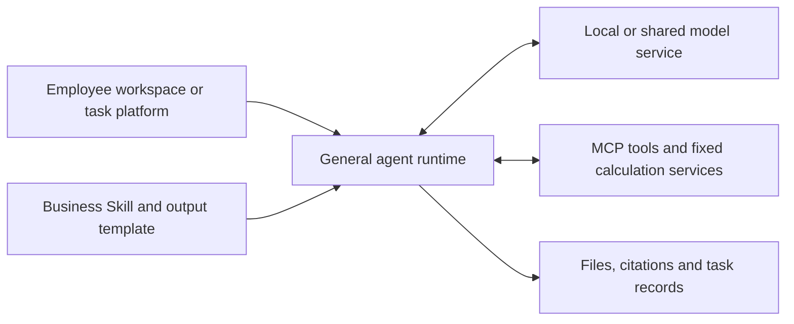

# On-Premise Reference Architecture

**Phase 2 — Weeks 3–5.** Required by [the final project plan](../../PROJECT_PLAN.md).
Status (24 September 2026): logical deployment choices, software research and
priced candidate hardware configurations are documented below. Physical selection
and workload measurements are the next inputs.

## Scenario 1 — personal and three-person Coding Agents

The [Scenario 1 design](scenario-1-personal-agent-2026-09-24.md) connects a local
Coding Agent to a personal model or a three-person shared model node. File tools,
project environments and NAS identity remain on each employee's computer. The
six workstation profiles use Qwen3.8-27B with explicit MLX/GGUF 8-bit budgets and
separate CUDA FP8 comparisons. Unified-memory systems reserve OS/tool memory
before model and KV allocation. Its [calculations](data/scenario-1-personal-agent-2026-09-24/)
separate prefill, decode, per-request speed, context capacity, prefix reuse and
shared versus independent-machine prices. All performance is conditional and
uncalibrated; hardware prices retain their 21 September observation dates.
The workload now fills 131,072 / 262,144 / 524,288 total tokens per session,
with 8,192 reserved for output. Cold loading and exact-prefix continuation are
separate; 524K uses an independently configured YaRN factor of 2. Memory admission
reserves eight additional state checkpoints per session and checks all three
users resident at once. The 256GB workstation therefore has a specific role in
the three-user 524K dense-model configuration.

## Scenario 3 — company Agent service

The [Scenario 3 design](scenario-3-company-agent-2026-09-23.md) uses at least 262K context per resident task and adds Hermes with
shared model inference, Skills/MCP and isolated execution. Central execution uses
per-user/project instances and a bounded tool pool; desktop execution runs Hermes
locally against the shared LLM endpoint. Both reuse Scenario 2's scoped retrieval
and NAS access. Its [task simulation](data/scenario-3-agent-2026-09-23/) models
multiple turns, growing contexts, bounded prefix retention, tool queues and task
completion. Six resource configurations include MiMo Flash/Pro, a Qwen reuse case
and the newly documented MI325X route. Results are analytical and uncalibrated.

## Serving and harness research — 17 September 2026

The [Scenario 2 design](scenario-2-enterprise-rag-2026-09-23.md) fixes the first
business scenario as permission-aware NAS knowledge search and RAG. It compares
Onyx Enterprise with Milvus, an application authorization/retrieval service and
Open WebUI. NAS remains the source of files and effective permissions. The
document specifies ingestion, model choices, hardware and initial costs, with
[reproducible capacity inputs and calculations](data/scenario-2-rag-2026-09-23/).
Results separate low-load latency, cold-cache bursts, prefill-inclusive throughput
and planning admission rates. Efficiency factors are analytical assumptions;
measured latency percentiles and deployment validation are still separate inputs.

- [Serving framework survey](serving-framework-survey-2026-09-17.md): vLLM,
  SGLang, TokenSpeed, Apple MLX/Metal and CPU/GPU heterogeneous paths, with
  licenses, version evidence, model routing and benchmark design.
- [Harness survey](harness-survey-2026-09-17.md): workflow libraries/platforms,
  general agents, self-hosted protocol compatibility and operating boundaries.

The candidate logical design separates the user/workflow or agent application,
model interface, inference engine, model weights, research tools, execution
environments and persistent state. Shared inference may serve isolated
per-user/per-task tool environments; it does not require sharing one shell or
one set of data-access credentials.

Prioritize vLLM/SGLang for shared GPU serving, with TokenSpeed as a targeted
comparison. On Mac compare MLX-LM/MLX-VLM with llama.cpp Metal. For large-memory
heterogeneous inference evaluate KTransformers/SGLang, llama.cpp and relevant
ik_llama.cpp optimizations. Workflow and general-agent choices are independent:
Dify/LangGraph address business processes; Hermes, OpenCode/pi and
protocol-compatible Codex CLI address general research and file tasks. This is a research shortlist,
not a selected production stack.

Interfaces must specify more than an "OpenAI-compatible" label: Chat Completions,
Responses and Anthropic Messages carry different request/event/tool semantics.
The model service and harness combination must pass protocol and end-to-end task
checks. The new survey distinguishes Claude Code's technically documented
third-party endpoint routes from its proprietary license and vendor support.

## Employee workspaces and general execution — 18 September 2026

The [harness survey](harness-survey-2026-09-17.md) uses Open WebUI as the
shared-chat reference and adds LobeHub for agent/project collaboration and
Cherry Studio for the personal desktop. LibreChat and AnythingLLM remain
comparators. Hermes Agent is the principal personal-task example; OpenClaw
illustrates persistent channels, device integration and replaceable harnesses.

Coding agents are also general execution environments. Codex and Claude Code
provide file operations, tools, context management and resumable work; Skills
package business methods, scripts provide fixed calculations and validation,
and MCP connects data and business services. LobeHub Desktop, Cherry Studio
and OpenClaw already document integrations with coding-agent runtimes.

A reference task can therefore use either a dedicated process application or
a general agent with a reusable business Skill. A business platform may trigger
and track the task, call Codex/Claude Agent SDK for research, validate outputs
with fixed code, then manage review and delivery. Local-model routes use the
selected harness's own provider configuration; ordinary workspace chat and
embedded/external agent drivers have separate runtime configurations.

Onyx/RAGFlow remain document/retrieval components; Dify/n8n and custom business
systems organize fixed processing, approvals and durable task state. These
components can be combined with the general-agent route. Primary evidence is
archived in TECH-056–063, with formal-release copies for selected integrations.

## Updated design basis — 16 September 2026

The user clarified that this is a professional institutional deployment.
Personal workstations should target the current 27B/35B-class Qwen and comparable
Gemma models, with sufficient accelerator memory and supported precision for
useful daily work. Shared service research includes DeepSeek-V4.1-Flash,
GLM-5.3/Flash and Kimi K3. See the [current candidate pool](../models/model-survey-2026-09-16.md).

Evaluate high-memory single-GPU systems, single-node multi-GPU systems and the
shared nodes required by the selected model and workload. No purchase budget or
device specification is confirmed. Compare costs after establishing quality and
service requirements; do not start from an assumed low-end device ceiling.
Maintain separate model-capability and deployment-readiness assessments.

The [license review](../models/license-review-2026-09-16.md) distinguishes model
rights, affiliate/use boundaries and internal adoption policy. A possible
headquarters preference for US vendors is an unconfirmed scenario, not a COD
requirement inferred from public sources.

COD is the infrastructure used in the host organization. Obtain the relevant system constraints
from the infrastructure owner before describing a design as tailored to COD.

## Server GPU comparison basis — 21 September 2026

The [server GPU procurement study](server-gpu-procurement-2026-09-21.md) covers
NVIDIA and AMD server GPUs for deployment
in mainland China. Procurement research records the exact product, export or
transfer conditions, latest vendor shipment disclosures, and complete-server
supply evidence. The candidate pool includes regional L20/RTX PRO 6000D SKUs, licensed H200
routes, and AMD MI308/MI325-family routes at different supply stages. It feeds personal-versus-shared
architecture work; each physical configuration is then tied to a model and task.

| Comparison field | Record for each candidate | How it affects the deployment |
|---|---|---|
| Product identity | Exact SKU, architecture, PCIe/SXM/OAM form and server platform | Host compatibility, installation and service options |
| Model storage | Memory capacity, type and supported weight formats | Full model placement and room for context and execution |
| Data movement | Memory bandwidth, GPU links, PCIe and scale-out networking | Generation speed, multi-GPU execution and communication cost |
| Software support | Driver/runtime and official serving/model path | Repeatable deployment and ongoing maintenance |
| Facility needs | GPU/module power, full-system power, cooling and physical format | Rack, power, cooling and operating costs |
| Procurement status | Dated rule, license/transfer conditions, latest shipment evidence | Which concrete purchase routes can be investigated |
| Supply and price | Vendor/OEM, country, stock or delivery statement, quote date and configuration | Acquisition budget, lead time and support |

The model resource baseline is the [current ten-model survey](../models/model-survey-2026-09-16.md).
Its indexed weight sizes support storage estimates. Runtime allocations add
context state, execution buffers and auxiliary models; precision and multi-GPU
layout are recorded with the chosen serving configuration.

Price comparisons use complete-server scope: GPU count, CPU, RAM, storage,
interconnect, support, delivery and tax treatment. Subsequent service analysis
connects each configuration to workload length, active tasks, model requests,
response time and accepted-task throughput. These inputs also feed the existing
[three-year TCO model](tco-model.md).

## MiMo-V2.6 addition — 22 September 2026

The [MiMo study](../models/mimo-v2.6-research-2026-09-22.md) adds Flash and Pro
to shared-service comparisons. Their main MXFP4/mixed-format indexes contain
172.92GB and 566.03GB respectively; draft/audio files and runtime allocations are
separate. Current vLLM recipes provide four-H200 and eight-H200 reference
configurations with a dedicated V2.6 build. The study records the 22 September
v0.30.0 source comparison and separates text, multimodal and speculative-decoding
paths. The existing server budget supplies acquisition inputs for these configurations.

The technical report also documents context state moving to CPU memory during
tool waits and back to GPU for generation. This is a useful source for the planned
long-agent/KV-offload comparison. The architecture study connects active model
requests, retained contexts and tool execution time before sizing concurrency.

## Required specification areas

### Priced hardware inputs — 21 September 2026

- [Workstations](workstation-configurations-2026-09-21.md): seven configurations
  across Ryzen AI Max, GB10, Apple M5 Max/Ultra and a 72GB RTX PRO tower; six
  three-person arrangements distinguish one shared node from three independent PCs.
- [Servers](server-gpu-procurement-2026-09-21.md): four/eight L20 and RTX PRO
  6000D, four H200 NVL, eight HGX H200 and eight MI325X, with CPU/RAM/storage,
  power/cooling, network and three-year hardware-support budget assumptions.
- [Price data](data/hardware-prices-2026-09-21.json): domestic public prices,
  overseas prices converted at an explicit scenario FX rate, component assumptions
  and reproducible acquisition-budget arithmetic. Apple prices are pre-order
  observations before the 22 September release; server totals are analytical estimates.

Each shared workstation has separate user sessions and tool environments. Three
independent workstations maintain separate model and context allocations. Measure
the same knowledge-answering, document-processing and long-agent tasks to connect
these configurations to active requests and response targets.

| Layer | Required design content | Evidence / input |
|---|---|---|
| GPU compute | GPU/cluster options, accelerator memory, CPU/RAM, capacity and scaling | Model requirements, measured workload, infrastructure constraints |
| Storage | Model artifacts, retrieval corpus, embeddings, application data, logs, backup | Volume, retention, access, and recovery assumptions |
| Networking | Server interconnect, application access, segmentation, approved ingress/egress | COD network constraints and source-backed requirements |
| Inference engine | Runtime/version, model formats, precision, serving and scheduling | Official documentation and local proof of concept |
| Vector database | Retrieval need, embedding approach, storage/indexing, access control | Task requirements and documented options |
| Orchestration | Deployment lifecycle, routing, job/service management, configuration | Existing environment constraints and support needs |
| Network security | Identity/access, isolation, traffic boundaries, auditability, update/support routes | Verified regulatory/MRM findings and internal inputs |

Document the role and justification of each component; mark components not needed
by the selected use case with a reason.

## Design package

- Workload and service-level assumptions.
- Logical component diagram and data flows.
- Physical hardware and software specifications, with versions and sources.
- Location/access for prompts, retrieved text, outputs, model artifacts, and logs.
- Capacity reasoning connected to measured latency, throughput, and memory.
- Availability, maintenance, monitoring, and operating responsibilities.
- Model/software update and vendor support paths.
- Open infrastructure or policy questions and their impact on design choices.

## Phase links

Use the [model survey](../models/benchmark-plan.md),
[local GPU proof of concept](../models/poc-plan.md), and
[regulatory evidence map](../regulation/index.md) as inputs.
Pass the bill of materials and operational assumptions to the Phase 3
[TCO comparison](tco-model.md).

A successful workstation proof of concept provides measurements; production
cluster sizing still needs workload and service-level analysis.
