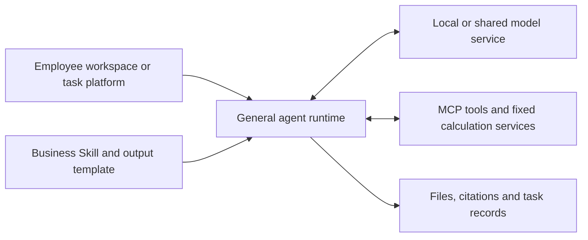

# On-Premise Reference Architecture

**Phase 2 — Weeks 3–5.** Required by [the final project plan](../../PROJECT_PLAN.md).
Status (18 September 2026): logical deployment choices and software research are
documented below; no physical configuration has been selected or benchmarked.

## Serving and harness research — 17 September 2026

- [Serving framework survey](serving-framework-survey-2026-09-17.md): vLLM,
  SGLang, TokenSpeed, Apple MLX/Metal and CPU/GPU heterogeneous paths, with
  licenses, version evidence, model routing and benchmark design.
- [Harness survey](harness-survey-2026-09-17.md): workflow libraries/platforms,
  general agents, self-hosted protocol compatibility and operating boundaries.

The candidate logical design separates the user/workflow or agent application,
model interface, inference engine, model weights, research tools, execution
environments and persistent state. Shared inference may serve isolated
per-user/per-task tool environments; it does not require sharing one shell or
one set of data-access credentials.

Prioritize vLLM/SGLang for shared GPU serving, with TokenSpeed as a targeted
comparison. On Mac compare MLX-LM/MLX-VLM with llama.cpp Metal. For large-memory
heterogeneous inference evaluate KTransformers/SGLang, llama.cpp and relevant
ik_llama.cpp optimizations. Workflow and general-agent choices are independent:
Dify/LangGraph address business processes; Hermes, OpenCode/pi and
protocol-compatible Codex CLI address general research and file tasks. This is a research shortlist,
not a selected production stack.

Interfaces must specify more than an "OpenAI-compatible" label: Chat Completions,
Responses and Anthropic Messages carry different request/event/tool semantics.
The model service and harness combination must pass protocol and end-to-end task
checks. The new survey distinguishes Claude Code's technically documented
third-party endpoint routes from its proprietary license and vendor support.

## Employee workspaces and general execution — 18 September 2026

The [harness survey](harness-survey-2026-09-17.md) uses Open WebUI as the
shared-chat reference and adds LobeHub for agent/project collaboration and
Cherry Studio for the personal desktop. LibreChat and AnythingLLM remain
comparators. Hermes Agent is the principal personal-task example; OpenClaw
illustrates persistent channels, device integration and replaceable harnesses.

Coding agents are also general execution environments. Codex and Claude Code
provide file operations, tools, context management and resumable work; Skills
package business methods, scripts provide fixed calculations and validation,
and MCP connects data and business services. LobeHub Desktop, Cherry Studio
and OpenClaw already document integrations with coding-agent runtimes.

A reference task can therefore use either a dedicated process application or
a general agent with a reusable business Skill. A business platform may trigger
and track the task, call Codex/Claude Agent SDK for research, validate outputs
with fixed code, then manage review and delivery. Local-model routes use the
selected harness's own provider configuration; ordinary workspace chat and
embedded/external agent drivers have separate runtime configurations.

Onyx/RAGFlow remain document/retrieval components; Dify/n8n and custom business
systems organize fixed processing, approvals and durable task state. These
components can be combined with the general-agent route. Primary evidence is
archived in TECH-056–063, with formal-release copies for selected integrations.

## Updated design basis — 16 September 2026

The user clarified that this is a professional institutional deployment.
Personal workstations should target the current 27B/35B-class Qwen and comparable
Gemma models, with sufficient accelerator memory and supported precision for
useful daily work. Shared service research includes DeepSeek-V4.1-Flash,
GLM-5.3/Flash and Kimi K3. See the [current candidate pool](../models/model-survey-2026-09-16.md).

Evaluate high-memory single-GPU systems, single-node multi-GPU systems and the
shared nodes required by the selected model and workload. No purchase budget or
device specification is confirmed. Compare costs after establishing quality and
service requirements; do not start from an assumed low-end device ceiling.
Maintain separate model-capability and deployment-readiness assessments.

The [license review](../models/license-review-2026-09-16.md) distinguishes model
rights, affiliate/use boundaries and internal adoption policy. A possible
headquarters preference for US vendors is an unconfirmed scenario, not a COD
requirement inferred from public sources.

COD is the infrastructure used in MSIM. Obtain the relevant system constraints
from the infrastructure owner before describing a design as tailored to COD.

## Required specification areas

| Layer | Required design content | Evidence / input |
|---|---|---|
| GPU compute | GPU/cluster options, accelerator memory, CPU/RAM, capacity and scaling | Model requirements, measured workload, infrastructure constraints |
| Storage | Model artifacts, retrieval corpus, embeddings, application data, logs, backup | Volume, retention, access, and recovery assumptions |
| Networking | Server interconnect, application access, segmentation, approved ingress/egress | COD network constraints and source-backed requirements |
| Inference engine | Runtime/version, model formats, precision, serving and scheduling | Official documentation and local proof of concept |
| Vector database | Retrieval need, embedding approach, storage/indexing, access control | Task requirements and documented options |
| Orchestration | Deployment lifecycle, routing, job/service management, configuration | Existing environment constraints and support needs |
| Network security | Identity/access, isolation, traffic boundaries, auditability, update/support routes | Verified regulatory/MRM findings and internal inputs |

Document the role and justification of each component; mark components not needed
by the selected use case with a reason.

## Design package

- Workload and service-level assumptions.
- Logical component diagram and data flows.
- Physical hardware and software specifications, with versions and sources.
- Location/access for prompts, retrieved text, outputs, model artifacts, and logs.
- Capacity reasoning connected to measured latency, throughput, and memory.
- Availability, maintenance, monitoring, and operating responsibilities.
- Model/software update and vendor support paths.
- Open infrastructure or policy questions and their impact on design choices.

## Phase links

Use the [model survey](../models/benchmark-plan.md),
[local GPU proof of concept](../models/poc-plan.md), and
[regulatory evidence map](../regulation/index.md) as inputs.
Pass the bill of materials and operational assumptions to the Phase 3
[TCO comparison](tco-model.md).

A successful workstation proof of concept provides measurements; production
cluster sizing still needs workload and service-level analysis.
