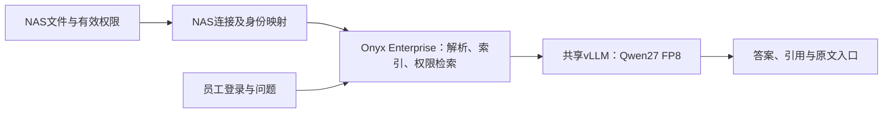
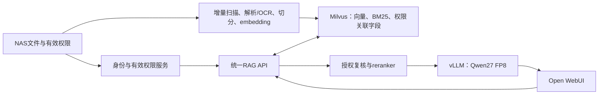

# 场景二：带NAS权限的公司知识库与RAG问答方案

**日期：2026年9月23日｜状态：方案设计与预算级性能测算。**

本文件为场景二的完整方案，供第四周报告选用。固定比较两条路线：**A：Onyx Enterprise私有化；B：Milvus＋自建权限／RAG服务＋Open WebUI。** 两者主用自托管Qwen3.8-27B FP8回答模型，原文件和权限继续以公司NAS为准。通用Agent属于后续场景三。

**主要模型：Qwen3.8-27B-FP8。** Onyx Enterprise与Milvus自建方案共用相同模型硬件。以四卡6000D、三张回答卡为例，20路8K输入／600输出的工程估算为：每路约21.5–22.0token/s，末路首token约37.4秒，整批约65.3秒完成。三张回答卡缓存池合计115.8GB，该负载约需16.79GB。

下文35B-A3B保留为历史效率对照，主方案与汇报均采用27B FP8。模型权重至少8-bit，KV为BF16／FP16。性能未实测校准，硬件与人工价格沿用原记录。

## 1. 场景边界与比较口径

| 项目 | 已知条件／本轮假设 |
|---|---|
| 业务 | 查询制度、流程、公共资料及按员工权限开放的部门资料，回答附原文出处 |
| 资料源 | 现有NAS；员工已能访问各自获授权的目录／文件 |
| 身份与权限 | 保留NAS有效权限；NAS品牌、协议、AD／LDAP或独立账号体系待IT提供 |
| 部署地点 | 中国境内自有环境，沿用[GPU采购研究](server-gpu-procurement-2026-09-21.md)的准确SKU与采购条件 |
| 文件类型 | Word、PDF、PPT、Excel；包括扫描件、表格、图表及旧版Office格式 |
| 文件规模 | 用户尚不清楚。本轮计算示例为**10万文件、平均20片段／文件、200万片段** |
| 使用规模 | **50账号**为规划假设；分别计算1／5／20／30／50个同时到达的问答请求 |
| 问答负载 | **8,192输入tokens＋600输出tokens**，输入包含问题、指令、历史和检索片段 |
| 模型执行 | FP8混合精度、文本问答、关闭思考输出和投机解码、前缀缓存命中率0；模型已加载 |
| 价格 | 人民币；GPU整机沿用9月21日预算，新CPU节点与实施量单列D估算 |

文件规模用于规划索引与入库；请求长度和到达方式用于规划在线服务。**50账号、50个活跃会话、50路同时生成**分别记录。例：50人每3分钟提交一次问题，每次占用30秒，平均进行中请求为`50×30÷180≈8.3`；峰值另由突发测试衡量。

## 2. 两条路线的完整组成

| 层次 | A：Onyx Enterprise | B：Milvus自建方案 |
|---|---|---|
| 员工入口 | Onyx原生搜索与问答界面 | Open WebUI；公司知识库请求路由至统一RAG服务 |
| 资料接入 | Onyx连接器＋纳入交付范围的NAS适配 | 自建NAS扫描／变更接入器 |
| 文件处理 | 原厂支持的解析、OCR与入库流程 | Docling／Office解析器、OCR worker和任务队列 |
| 权限 | Onyx企业权限体系＋NAS身份／ACL映射 | 独立身份／权限服务，负责有效权限求值、更新与复核 |
| 检索与索引 | 使用所选Onyx版本原生支持的后端；本轮官方Helm sizing已采用OpenSearch | **Milvus 2.6.x维护版本**，向量＋BM25混合检索、标量过滤 |
| Embedding／reranker | 采用原厂支持的本地模型组合，验收中文资料和延迟；指定Qwen模型时验证适配 | Qwen3-Embedding-0.6B＋Qwen3-Reranker-0.6B作为首轮基线 |
| 回答模型 | 自建vLLM OpenAI兼容端点；Qwen3.8-27B FP8 | 同左 |
| 管理与运维 | 原厂平台提供管理、索引作业、权限与审计，集成商承担约定接入 | 项目团队维护管理API、索引作业、权限同步、监控、升级及恢复 |

Onyx官方资料已覆盖私有化、自定义模型端点、企业组权限和指定连接器的源权限同步。[TECH-068](../sources/TECH-068/original.md) 本机构NAS尚未完成连接验证，因此**A的采购交付范围明确包含NAS连接、文件权限映射、撤权与引用访问测试**。Onyx原生支持SharePoint等资料源的事实，和该NAS适配的验收分别记录。

### A路线的数据流



### B路线的数据流



## 3. B路线：权限管理怎样开发

Milvus的RBAC管理实例、数据库和collection层面的操作；文件级权限由应用服务与检索过滤协同实现。Milvus支持检索前标量过滤、数组过滤和全文检索，可承载权限关联字段。[过滤检索](https://milvus.io/docs/v2.6.x/filtered-search.md)、[RBAC](https://milvus.io/docs/v2.6.x/rbac.md)、[数组操作](https://milvus.io/docs/v2.6.x/array-operators.md)

### 3.1 五个开发模块

1. **身份映射。** 对接公司登录身份，将不可由客户端自行修改的用户标识映射到NAS账号、SID及有效用户组。目录服务存在嵌套组时完整解析；保持账号停用／调岗更新。
2. **权限采集与求值。** 保留共享目录和文件系统的权限、继承关系及版本；按实际NAS规则求有效读权限。NAS／Windows ACL包含的显式与继承条目，交由兼容的权限求值逻辑处理。
3. **权限关联索引。** 每个文档及其片段保存稳定`doc_id`、来源、版本、`acl_policy_id`、权限版本及页／表定位。相同权限的文件可共用policy，避免每条片段复制整份复杂ACL。
4. **统一查询鉴权。** 后端依据当前员工计算授权范围，为向量与BM25检索同时加入过滤条件；第一轮候选先返回内部ID和分数，经当前有效权限复核后才取正文、重排序并交给LLM。原文下载、引用和导出使用同一鉴权服务。
5. **更新与审计。** 内容变更更新对应片段和向量；权限变更更新policy与关联字段，撤销相关缓存。缓存按用户／有效授权范围及权限版本隔离；权限未取得或校验失败的候选保持不可用。

员工通过Open WebUI登录后，可信后端向RAG服务传递经验证的身份。Milvus凭据和源文件抓取权限只授予服务端组件，员工请求中的目录名、用户组或过滤表达式由后端验证和重建。Open WebUI的扩展／Pipelines可作为调用接口，身份传递与鉴权属于本项目实现内容。[TECH-069](../sources/TECH-069/original.md)

### 3.2 NAS适配的交付与验收

按真实NAS确定文件协议、ACL读取方法和身份来源。读取文件、读取权限、按员工身份校验访问分别设接口。候选授权复核可通过NAS支持的权限检查或受信任身份委托完成；缺少在线校验能力时，需明确权限同步时限和失效策略，并将其列入验收。

验收至少包含：允许与拒绝的不同员工、嵌套组、继承与例外权限、文件移动、权限撤回、账号停用、直接调用检索API、引用下载及缓存命中。两个方案使用相同案例；以员工实际可读取的文件作为对照。

## 4. 文档处理、索引和模型

### 4.1 文件入库

| 格式 | 处理方式与保留信息 |
|---|---|
| Word | 解析标题层级、段落与表格；保存文档版本及段落定位 |
| PDF | 识别数字文本／扫描页，必要时OCR；保留阅读顺序、页码、表格、单位和脚注 |
| PPT | 按页提取标题、正文、表格与图表说明，保存页码；图像内容按需要调用视觉解析 |
| Excel | 按工作表与表格区域提取，保存表头、单位、单元格位置；公式和显示值分开记录 |
| 旧DOC／XLS／PPT | 通过受控Office转换组件统一格式，再进入相应解析流程 |

Docling官方支持上述现代Office格式及PDF，旧二进制Office格式使用LibreOffice转换。[格式文档](https://docling-project.github.io/docling/usage/supported_formats/) 语义切分保留文档结构：正文分段、表格按完整表头和行块处理、PPT按页组织。跨表汇总和精确计算交给结构化查询／固定脚本；本场景主要交付证据查询与回答。

采用文件ID／路径、修改标记、内容哈希及解析器版本判断变化；只为新增或内容变更片段重新计算embedding。权限变化更新授权元数据。失败作业保留原因和重试状态，删除和移动同步到索引与引用入口。

### 4.2 模型与精度

| 职责 | 本轮选择 | 资源／设置 |
|---|---|---|
| 效率对照 | **Qwen3.6-35B-A3B-FP8** | 官方激活约3B、全量权重仍驻留；按HF dtype元素数推导约37.455GB，预算向上取37.5GB |
| **回答主候选** | **Qwen3.8-27B-FP8** | 稠密27B；同口径推导约30.864GB，预算向上取31GB |
| 向量模型 | **Qwen3-Embedding-0.6B** | 1024维作为首轮索引设置；约0.596B BF16参数，tensor约1.192GB |
| 重排序模型 | **Qwen3-Reranker-0.6B** | 候选片段与问题成对评分；同量级BF16参数 |

准确修订和官方原文见[TECH-070](../sources/TECH-070/original.md)。主模型FP8制品混有BF16层，不能直接把原BF16文件体量除以二。主模型独立Apache 2.0许可已归档；embedding／reranker模型卡声明Apache 2.0，独立LICENSE文件本轮未取得，采用资料据实记录。

容量模型按一次问答调用一次主回答模型计算。Onyx若启用问题改写、多步搜索或额外LLM判分，另按实际调用次数和token增加负载。

默认一次问答：关键词与向量各召回约50条，合并去重后授权复核，选择约20条重排序，约8条进入上下文。控制合计输入在8K附近；较长材料单独进入32K档。回答显式关闭thinking，生成预算600tokens，引用回到NAS文件及页／表位置。

### 4.3 入库与存储的数量级

10万文件×20片段＝200万片段。1024维FP32向量的原始字节为`2,000,000×1024×4＝8.192GB`。正文、标量／全文／向量索引结构、预览图、副本与备份另计，初始CPU节点按128GB内存和企业SSD配置。

若平均每片段512tokens，首次embedding约需处理10.24亿tokens。**在8,000–32,000 tokens/s的纯假设吞吐下，embedding计算时间约8.9–35.6 GPU小时**；这只是用于计划的敏感性例子，解析、OCR、NAS扫描、失败重试和索引写入另测。上线后的持续成本取决于每日变更量。在线embedding／reranker优先，批量OCR与重建安排独立队列和配额。

## 5. 四档共用硬件与购置预算

为公平比较A／B，采用相同回答模型和GPU配置。**每档预留1张GPU承担embedding、reranker及受限速的文档处理；其余GPU各运行一个TP1回答模型副本。** 该划分避免把全部卡数都算成生成吞吐。新增模型副本提升并行请求能力，单个请求仍使用一张卡。

所有GPU服务器沿用9月21日已列CPU、主存、NVMe、网卡、供电和三年硬件支持BOM；价格为D分析预算。新增两台应用／检索CPU节点，每台16–32核x86、128GB ECC、2×3.84TB企业NVMe镜像、10／25GbE、冗余电源与基础硬件支持。

| 档位 | GPU服务器 | 生成／辅助GPU | 原GPU整机预算 | 加两台CPU节点后的硬件预算 |
|---|---|---:|---:|---:|
| H1 | 4×L20 48GB；512GB主存；90%基线采用27B FP8 | 3／1 | 40–74万元 | **52–100万元** |
| H2 | 4×6000D 84GB；1TB主存 | 3／1 | 62–115万元 | **74–141万元** |
| H3 | 8×6000D 84GB；2TB主存 | 7／1 | 109–200万元 | **121–226万元** |
| H4 | 4×H200 NVL 141GB；1.5TB主存 | 3／1 | 169–345万元 | **181–371万元** |

来源：[完整GPU服务器BOM及预算](server-gpu-procurement-2026-09-21.md)、[价格数据](data/hardware-prices-2026-09-21.json)。两台CPU节点是应用与数据角色分工；完整高可用的仲裁、存储副本和故障切换按所选SLA增加，本表不计新建机房、NAS扩容与持续运维。

**CPU节点新增估价。** 每台硬件税前：128GB RAM 1.6–3.4万元，CPU／平台／电源2.0–3.8万元，NVMe／网络0.9–1.8万元，合计4.5–9.0万元。采用13%硬件税准备＋10%价格准备＋含税支持0.5–1.0万元，得到6.035–12.07万元，预算向外取整为**6–13万元／台，D**。RAM假设沿用既有价格模型，其余为本轮集成准备金，未取得准确OEM报价。

### 5.1 KV显存与总context容量

按每张**回答卡**计算：`缓存池＝显存×90%－常驻权重－6GB运行时预留`。KV与状态有效负载再乘1.15计入页块及对齐准备；辅助GPU用于embedding／reranker，其显存单独计量。回答模型权重为FP8混合精度，**KV统一为BF16／FP16**。

- **35B-A3B：**10个全局注意力层，每token KV为20,480字节；每条驻留会话另需约64.39MB递归与卷积状态。
- **27B：**16个全局注意力层，每token KV为65,536字节；每条驻留会话另需约153.94MB递归与卷积状态。

两者均为全局注意力与线性注意力混合结构。本表保留一份活跃递归／卷积状态，按20条独立会话计算；实际引擎的状态检查点与物理页块分组在部署时核对。两个模型的原生单请求上限均为262,144tokens。[固定模型配置](../sources/TECH-070/original.md)

| 档位 | 回答模型 | 单卡／回答卡合计缓存池/GB | 仅按显存可保留的总context/M | 20路统一context配额/K |
|---|---|---:|---:|---:|
| H1 | 35B-A3B | 每卡预算不足0.3GB | — | — |
| H1 | 27B | 6.2／18.6 | 0.197 | 9.216 |
| H2 | 35B-A3B | 32.1／96.3 | 4.025 | 191.488 |
| H2 | 27B | 38.6／115.8 | 1.487 | 70.656 |
| H3 | 35B-A3B | 32.1／224.7 | 9.476 | 262.144 |
| H3 | 27B | 38.6／270.2 | 3.535 | 168.192 |
| H4 | 35B-A3B | 83.4／250.2 | 10.557 | 262.144 |
| H4 | 27B | 89.9／269.7 | 3.529 | 167.936 |

K＝1,000、M＝1,000,000tokens；context包含输入、历史和生成结果。三副本将20路分成7／7／6，七副本分成3／3／3／3／3／3／2。最后一列以**最拥挤副本**决定所有用户的统一配额，并取模型上限；每个副本的缓存池独立使用。总context的显存预算与应用配置的单请求长度分别列出。

**H2／35B示例：**每卡缓存池为`84×90%－37.5－6＝32.1GB`，三卡合计96.3GB。按20路同时保留，每路统一预算191,488tokens，合计约3.830M；按各副本分别分配不同长度，上表显存总预算约4.025M。日常8,192输入＋600输出的20路只需**5.62GB**，其中已计状态和15%缓存准备；27B同负载约需16.79GB。

**L20的紧配边界：**单卡35B权重37.5GB＋运行时6GB＝43.5GB，超过90%显存预算43.2GB，当前基线没有KV余量。95%显存利用率可留2.1GB缓存池，其独立测算见第6.5节。H1／27B在20路下每路约9,216tokens，8,192＋600tokens工作负载可以放入，扩展上下文时需减少同时驻留请求。

因此，场景二保留8K日常输入和32K长资料对照即可。容量余量用于更多问答、较长引用和缓存；实际可服务并发由推理、检索／重排序及响应目标共同决定。

## 6. 响应时间与吞吐：计算结果

### 6.1 统一口径

- **Prefill总吞吐：**输入tokens总数÷有prefill活动的墙钟时间；20路无排队时，分母为最慢副本的输入处理时间。
- **Decode总速率：**各副本在同一时刻生成的输出token/s之和。下表20路均有共同生成的时间段；每路速度按其所在副本分别计算。
- **模型首token／完整问答首token：**前者计模型排队与推理；后者再计身份、检索、重排序和网络。基准前置链路为0.8秒。
- **整段时间输出吞吐：**全部输出tokens÷从提问到整批回答完成的时间，计入prefill与检索。

所有结果为未实测校准的条件式估算。固定20路同时到达、每路8,192输入／600输出、冷缓存、模型已加载，关闭thinking和投机解码。内核效率与带宽利用率是第7节的待校准输入，工程假设和硬件规格分开记录。

### 6.2 20路问答：模型速度与用户等待时间

| 档位 | 模型 | Prefill总吞吐/输入token/s | Decode总速率/输出token/s | 每路decode/token/s | 完整问答末路首token/秒 | 整批完成/秒 | 整段时间输出token/s |
|---|---|---:|---:|---:|---:|---:|---:|
| H1 | 35B-A3B | — | — | — | — | — | 90%显存预算不足 |
| H2 | 35B-A3B | 22,643 | 1,027 | 50.2–54.1 | 8.1 | 20.0 | 601 |
| H3 | 35B-A3B | 52,833 | 1,439 | 71.1–79.9 | 3.9 | 12.3 | 972 |
| H4 | 35B-A3B | 124,534 | 2,565 | 126.2–133.1 | 2.1 | 6.9 | 1,746 |
| H1 | 27B | 2,467 | 272 | 13.5–13.8 | 67.3 | 111.7 | 107 |
| H2 | 27B | 4,485 | 432 | 21.5–22.0 | 37.4 | 65.3 | 184 |
| H3 | 27B | 10,464 | 475 | 23.7–24.3 | 16.5 | 41.8 | 287 |
| H4 | 27B | 24,665 | 1,343 | 66.7–68.2 | 7.5 | 16.4 | 730 |

H2的三张回答卡运行独立模型副本，20路分为7／7／6。7路副本每路约50.2token/s，6路副本每路约54.1token/s，合计约1,027token/s。包含prefill的完整问答吞吐约601token/s，两个数字使用不同时间口径。

**H2／35B推导：**7路副本每步估计读取约14.19GB权重、KV、状态及其他数据，假设有效带宽838.8GB/s，内存时间约16.91ms；计算时间约0.97ms，再加3ms执行开销，每步约19.91ms，每路约50.2token/s。该副本prefill约7.24秒、decode约11.95秒，加0.8秒检索链路，总计19.98秒。20×600÷19.98约为601token/s。其模型首token约7.26秒，完整问答首token约8.06秒。

三副本开始和结束生成的时间略有差异；数据中另保留整个生成活动窗口的平均输出吞吐，本例约924token/s。主表的1,027指20路共同生成时的合计速率。实际压测同时采集每路时延和整段时间吞吐，以对应使用体验和服务容量。

### 6.3 H2／35B：并发变化

| 同时提交请求数 | 分到三副本的请求数 | Decode总速率/token/s | 每路decode/token/s | 末路首token/秒 | 整批完成/秒 | 整段时间输出token/s |
|---:|---|---:|---:|---:|---:|---:|
| 1 | 1／0／0 | 91 | 91.4 | 1.8 | 8.4 | 71 |
| 5 | 2／2／1 | 411 | 79.9–91.4 | 2.9 | 10.4 | 289 |
| 20 | 7／7／6 | 1,027 | 50.2–54.1 | 8.1 | 20.0 | 601 |
| 30 | 10／10／10 | 1,252 | 41.7 | 11.2 | 25.5 | 705 |
| 50 | 17／17／16 | 1,557 | 30.8–31.9 | 18.4 | 37.9 | 792 |

并发增加时，组批提高系统吞吐，每路生成速度及首token等待分别变化。三档效率参数下，H2／35B的20路整批完成约14.4–30.4秒；这些是参数敏感性情景。固定账号数用于估算请求到达率，例如50人每3分钟一问约16.7问／分钟，再按突发请求检验等待时间。

### 6.4 输入长度：日常问答与长资料

| H2模型 | 每路输入tokens | 20路末路首token/秒 | 20路整批完成/秒 |
|---|---:|---:|---:|
| 27B | 4,096 | 18.9 | 45.4 |
| 27B | 8,192 | 37.4 | 65.3 |
| 27B | 32,768 | 158.1 | 194.0 |
| 35B-A3B | 4,096 | 4.3 | 15.8 |
| 35B-A3B | 8,192 | 8.1 | 20.0 |
| 35B-A3B | 32,768 | 37.5 | 51.9 |

在相同硬件下，35B-A3B的20路8K输入约20秒完成，32K输入约52秒；27B对应约65秒和194秒。日常RAG通过检索和重排序选择足够回答问题的片段，输入长度因此是响应时间的重要变量。这里比较相同输入／输出长度，回答质量由同一份问题与引用标准另行评估。

### 6.5 H1／35B的95%显存紧配对照

原版H1结果采用95%显存利用率。本次正文与场景三统一为90%，并补齐15%缓存开销和卷积状态；H1／35B的95%配置作为单独情景保留。在单卡2.1GB缓存池下，8K输入／600输出每批最多7路；20路整批约32.2秒、373输出token/s，50路经后续批次排队约81.7秒、367输出token/s。

这些结果适用于该显存配置及6GB运行时假设；容量统一保守按标称GB的十进制字节计算，H1边界对实际可见显存和运行时用量敏感，部署时由引擎内存分析确认。90%分析基线中的H1采用27B FP8，H2–H4继续比较27B与35B。

## 7. 性能模型、参数与适用范围

### 7.1 来源与工程假设

| 参数 | L20 | 6000D | H200 NVL | 性质 |
|---|---:|---:|---:|---|
| 标称显存 | 48GB | 84GB | 141GB | 厂商规格；本模型保守按每GB＝10^9字节预算，上线以设备实际可见字节替换 |
| 标称显存带宽 | 864GB/s | 1398GB/s | 4800GB/s | HPE／NVIDIA规格 |
| 有效计算速率：低／基准／高 | 35／55／80 TFLOP/s | 60／100／145 TFLOP/s | 350／550／800 TFLOP/s | **D工程敏感性假设，未用目标设备实测校准**；不是厂商峰值 |
| 带宽利用率：低／基准／高 | 45%／60%／75% | 同左 | 同左 | D假设 |

其他假设：MoE有效计算速率再乘0.60，覆盖专家调度和小矩阵效率；非主要矩阵计算的FLOPs准备系数1.15；每步固定开销稠密模型4／2／1ms、MoE 5／3／1.5ms；身份、检索、重排序和网络总延迟1.8／0.8／0.4秒，按各用户并行处理，前置服务吞吐需单独验收。每GPU运行时预留6GB，最多使用90%标称显存，KV与状态有效负载乘1.15计缓存开销，单副本批次上限32。H1／35B的95%配置单列敏感性结果。

本轮发现厂商／第三方表格存在dense与sparse峰值混用，6000D与标准96GB RTX PRO也有区别。因此计算显式使用有效计算速率作为待校准变量，并使用准确SKU的带宽；不能把另一款GPU的benchmark按卡名代入。方法参考JAX团队的[Roofline](https://jax-ml.github.io/scaling-book/roofline/)和[推理分析](https://jax-ml.github.io/scaling-book/inference/)，原件见[TECH-071](../sources/TECH-071/original.md)。

以27B FP8的每步31GB读流量为例，先忽略KV和其他开销，`标称带宽÷31GB`给出的模型内理想单路上限分别为**L20约27.9、6000D约45.1、H200约154.8 tokens/s**。加入KV／状态流量、带宽利用率与执行开销后，单请求基准生成速度约16／25／76token/s，完整单请求指标保存在结果数据中。这一比较固定FP8和逐token生成方式。

### 7.2 主要公式

记输入长度为`S`、输出长度为`O`、单GPU批量为`B`、全局注意力层数为`L`、查询头数为`Hq`、头维度为`D`、激活参数为`Pactive`。

1. **输入计算量：**`Fprefill ≈ 2 × Pactive × S × 1.15 + 2 × L × Hq × D × S²`。后项为因果全局注意力QK与AV。批量输入时间`Tprefill(B)=B×Fprefill/F有效`。
2. **稠密模型权重读流量：**每个生成步按31GB预算；一个批次可复用同一轮权重读取。
3. **MoE权重读流量：**假设各请求独立、均匀选择256专家中的8个，则被批次触及的专家比例`u(B)=1−(1−8/256)^B`；每步权重流量`W(B)=5.3GB＋32.2GB×u(B)`。32.2GB由40层、256专家、每专家三矩阵及FP8存储近似；5.3GB为非专家制品的保守读取准备。
4. **每步生成时间：**`Tstep=max[(权重＋KV＋线性注意力状态及其他读写流量)/有效带宽, 生成计算量/有效算力]＋固定开销`。即对内存时间和计算时间取较大者后再加开销。
5. **单次／同批响应：**`TTFT=T检索+T排队+Tprefill+Tstep`；`T完成=T检索+T排队+Tprefill+O×Tstep`。
6. **吞吐：**`整批平均输出吞吐=C×O/整批完成时间`；单副本持续混合服务能力`B/(Tprefill+O×Tstep)`，多副本分别相加后取70%作规划限流。

每请求KV按全局注意力层的`2×KV头数×头维度×2字节`计算：27B每token 65,536字节，35B每token 20,480字节；线性注意力递归状态按FP32、卷积状态按BF16预算，两者合计分别约153.94MB、64.39MB，每步计读写。驻留预算为`[(S＋O)×KV字节/token＋固定状态]×1.15`；每副本准入请求数受可用缓存池及批次配置共同限制。

### 7.3 队列模型怎样解释

本轮采用便于审计的**分阶段批次**：一个批次先完成prefill，再生成答案；请求超过批次／显存上限时进入后续批次。它把突发拥塞明确计入，并没有模拟vLLM连续批处理的全部交错行为。连续批处理和chunked prefill可改善首次显示的分布，真实平台也可能出现额外竞争。

低负载首token、同到达最后首token、整批完成时间和规划每分钟请求数各有定义，不互相冒充。硬件规格能支持带宽／容量上限和条件式计算；有效算力、调度、检索尾延迟、专家分布及P95要在部署后校准。本文件提供的是可重算的预算模型。

## 8. 企业平台与自建方案的项目价格

### 8.1 H2基线：同硬件比较

| 成本项 | A：Onyx Enterprise | B：Milvus自建 |
|---|---:|---:|
| GPU＋两台CPU节点 | 74–141万元，D | 74–141万元，D |
| 首次实施与验收 | 42–68人天×2,500元＝**10.5–17万元，D** | 70–110人天×2,500元＝**17.5–27.5万元，D** |
| 软件 | Onyx Enterprise私有化授权／支持报价记为`L` | 开放组件按许可部署，未另计商业支持采购 |
| 首次购置＋实施 | **84.5–158万元＋L** | **91.5–168.5万元** |

2,500元／人天是本研究的完整人天成本假设；工时为工程估算，非Onyx或供应商报价。A包含原厂安装、NAS／身份权限适配、资料调优与共同验收；B增加RAG API、作业管理、权限与更新逻辑的开发。人天是投入量，项目日历还受人员并行与IT环境准备影响。

| 工作项 | A人天，D | B人天，D |
|---|---:|---:|
| 平台／运行环境 | 8 | 10–15 |
| NAS、身份、权限映射与撤权 | 15–25 | 15–25 |
| 文档入库、解析与更新 | 5–10 | 10–15 |
| 检索调优、接口／入口、引用 | 6–10 | 10–15 |
| 验收、压力测试与权限测试 | 5–10 | 15–25 |
| 运维文档、备份恢复与交接 | 3–5 | 10–15 |
| **合计** | **42–68** | **70–110** |

Onyx官方价格页把私有化列入Enterprise并要求询价；公开Business云订阅不用于替代`L`。[官方价格](https://onyx.app/pricing) 做预算敏感性时，若**纯假设**第一年`L=10／30／60万元`，A对应首次投入为**94.5–168／114.5–188／144.5–218万元**。这三个授权值只是可替换变量，没有推断厂商成交价。

### 8.2 其他硬件档位

| 硬件档 | 硬件/万元 | A首次购置实施/万元 | B首次购置实施/万元 |
|---|---|---|---|
| H1 | 52–100 | 62.5–117＋L | 69.5–127.5 |
| H2 | 74–141 | 84.5–158＋L | 91.5–168.5 |
| H3 | 121–226 | 131.5–243＋L | 138.5–253.5 |
| H4 | 181–371 | 191.5–388＋L | 198.5–398.5 |

上述GPU估价已包含对应的税费、硬件价格准备和硬件支持，CPU节点也按相同方式估算，避免再重复加税或维护费。持续应用运维、用电、年度软件续费、NAS增容、机房和完整HA扩建进入后续TCO。现有四卡H200估价基于组件和集成假设，八卡HGX另有整机价格锚点；采购时按同一OEM、保修与许可交付口径询价。

## 9. 两条路线如何验收与交付

| 项目 | 两条路线的共同验收内容 |
|---|---|
| 权限 | 员工实际可读文件与检索、片段、引用、导出的结果一致；覆盖撤权与接口直接访问 |
| 文档质量 | 四类格式各取代表样本，核对页／表定位、标题、单位、表头、数字及版本 |
| 检索质量 | 固定问题集，标注正确文档／片段，检查召回、重排序与答案引用 |
| 回答质量 | 固定相同模型和生成预算，记录正确性、证据完整性、人工修改量 |
| 性能 | 4K／8K／32K输入、600输出；1／5／20／30／50并发；报告prefill、decode、每路速度、模型／完整问答TTFT、整段输出吞吐与请求率；实测统计P50／P95 |
| 资源与稳定性 | 每副本实际KV池、KV精度、状态和页块分配、目标context并发、峰值显存、CPU／SSD、OOM、重试、取消、入库干扰与权限同步延迟 |
| 运维 | 索引重建、文件更新／删除、模型升级回退、备份恢复、版本及数据流说明 |

采用vLLM的吞吐、TTFT、TPOT与goodput测量，再从前端测完整RAG响应。[benchmark文档](https://docs.vllm.ai/en/latest/cli/bench/serve/) 同一硬件、相同模型服务下，平台间差异主要体现在资料接入、检索质量、权限、前置延迟和运维；本模型为两者统一使用0.4–1.8秒前置延迟情景，尚无两个平台的实测性能排名。

**本轮完成边界：**场景二的两条路线、开发分工、文件处理、模型、四档硬件、预算和响应／吞吐计算已形成文档。Onyx授权价、实际NAS身份与ACL接口、真实文件规模和目标设备效率作为可替换输入集中管理。后续讨论进入场景三，沿用本场景的授权检索接口与模型服务。

## 10. 数据、来源与复算

本次复算保留120组性能情景：105组满足当前内存预算，15组H1／35B标记为预算不满足；另列40组context容量、H2的输入长度对照及H1的95%显存情景。价格与平台方案沿用原输入。

- [假设与硬件／模型输入](data/scenario-2-rag-2026-09-23/assumptions.json)
- [120组性能情景、40组context容量、长度／显存敏感性与预算](data/scenario-2-rag-2026-09-23/results.json)
- [计算脚本](data/scenario-2-rag-2026-09-23/calculate_capacity.py)
- [TECH-068：Onyx原文](../sources/TECH-068/original.md)
- [TECH-069：Milvus、NAS权限、前端与解析原文](../sources/TECH-069/original.md)
- [TECH-070：四个Qwen模型固定制品](../sources/TECH-070/original.md)
- [TECH-071：性能方法、GPU与引擎资料](../sources/TECH-071/original.md)

在仓库根目录执行：

```bash
python3 knowledge-base/infrastructure/data/scenario-2-rag-2026-09-23/calculate_capacity.py
```

来源保持原语言，提取文件和metadata记录URL、读取时间及SHA-256。研究与计算由主agent完成；本轮没有连接公司NAS、下载完整模型、安装平台、发出询价或执行GPU benchmark。正文中的算力效率、资料量及实施人天为显式分析输入。
