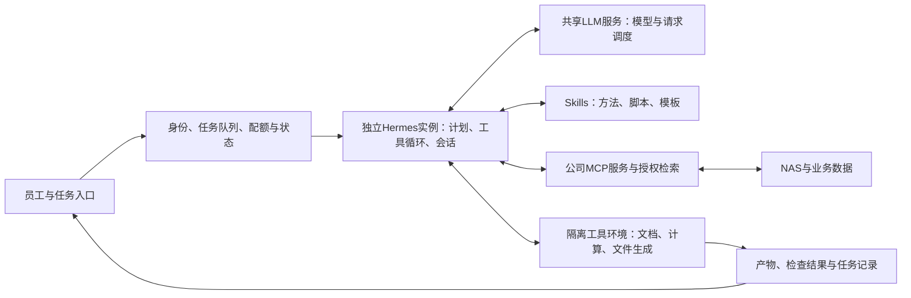

# 场景三：公司共享模型、通用工具链与通用Agent

**日期：2026年9月23日｜状态：方案设计、预算、模型推理与任务级性能估算。**

本文件沿用[场景二](scenario-2-enterprise-rag-2026-09-23.md)的结构，给出公司级通用Agent的完整组合。主线为**Hermes Agent＋公司共享模型服务＋业务Skills／MCP工具＋隔离执行环境**；现有NAS、员工身份及授权检索继续复用。文档比较集中执行和员工电脑执行两种形态，并按具体任务计算响应、吞吐、缓存与价格。

**主部署口径：每个任务至少262,144总context，20个任务同时驻留并推理。** MiMo-V2.6 Flash／Pro继续使用发行者官方混合精度制品；Qwen个人／知识库模型的8-bit下限不套用于MiMo。以四卡H200 Flash为例，20任务时每任务的架构内存上限约566K；在实际使用262K、保留精确前缀并新增1K输入的测算中，每路生成约34token/s。

下文8K／600及短任务轨迹保留为对应负载的历史对照。当前汇报使用第4.5节的长上下文预算及新测算文件，输入、输出和任务状态均纳入每任务context。

## 1. 业务用途与交付物

员工交给Agent一个目标和资料范围，Agent读取文件、查询资料、执行计算、检查结果，并交付可继续编辑的成果。三个贯穿例子如下：

| 任务 | 输入 | Agent完成的工作 | 交付物 |
|---|---|---|---|
| 材料汇总 | 若干公告、制度或研究资料 | 查来源、比较差异、整理结构、补齐引用 | 简报、对照表、来源清单 |
| 财报与Excel比较 | 两期财报、Excel／CSV及口径说明 | 对齐期间和单位、计算指标、核对加总、解释变化 | 可编辑Excel、图表和文字说明 |
| 长程研究与报告 | 多份文件、研究问题及输出模板 | 多轮查证、分步分析、生成与检查图表、整合文稿 | 报告草稿、证据表和待人工判断的问题 |

场景二的授权检索作为工具返回资料片段与引用；本场景的Agent接续完成分析和文件处理。默认知识工具调用**检索接口**，不额外重复调用场景二的回答模型。结果进入用户／项目工作目录，业务人员复核后再纳入正式流程。

## 2. 两种执行形态

| 部分 | 集中执行：本轮主方案 | 员工电脑执行：轻量接入方案 |
|---|---|---|
| 使用入口 | Hermes Desktop连接远程实例，或Open WebUI／内网任务入口通过API接入 | 员工电脑上的Hermes Desktop／CLI |
| 模型推理 | 公司共享vLLM／SGLang模型服务 | 同一公司共享模型服务 |
| Agent状态 | 每用户／项目独立实例、配置、会话、记忆和工作目录 | 本机独立状态，公司统一分发模型与工具配置 |
| 文件／代码执行 | 服务器上的容器／VM，集中调度CPU、内存和任务槽位 | 员工账号下的本机环境与已挂载NAS |
| 公司工具 | 统一MCP／API服务，携带员工身份 | 同左；本机文件工具另外受员工操作系统权限控制 |
| 管理重点 | 任务队列、运行环境、并发、日志、产物及失败恢复 | 客户端分发、依赖一致性、终端管理及本机资源 |
| 适合工作 | 批量文件处理、较长任务、需要集中维护的工具 | 与个人当前目录、Office文件和日常操作紧密结合的任务 |

两种形态的LLM均在公司服务器运行。个人电脑承担模型推理的配置留给场景一。Hermes是这里的主讲harness；OpenClaw保留为渠道／设备接入对照，模型端点与MCP服务可以独立复用。

连接方式分别固定：**集中入口连接Hermes Agent API，工具在服务器执行；桌面方案在员工电脑运行Hermes，再连接共享vLLM模型API，工具在本机执行。** 这样可以直接沿用员工本机已授权的NAS访问，而服务器方案使用独立的身份与工具接入。

### 集中执行架构



**产品已有能力与集成分工：**Hermes已有Desktop、API Server、模型配置、Profiles、Skills、MCP及Docker／SSH工具后端，并提供[Open WebUI接入指南](../sources/TECH-072/open-webui.md)。本项目建设公司身份路由、实例管理、任务配额、业务工具和成果交付；多用户入口按可信身份路由到独立实例，避免仅用一个共享API key区分所有员工。[TECH-072](../sources/TECH-072/original.md)

## 3. Harness、工具链与权限的具体组成

### 3.1 Hermes怎样部署

- 模型provider指向内部兼容端点，分别配置主模型、备用模型及辅助调用，统一记录实际路由。
- 每位员工／项目使用独立Hermes数据目录和进程；配置、会话、记忆及工具凭据按主体隔离。
- 集中工具运行在独立容器／VM工作环境。Hermes的Docker终端后端默认是**每个Hermes进程一个持久容器**，跨工具调用保持文件和安装状态，因此公司隔离落实到实例和操作系统资源边界。
- 基线每实例同时执行一项任务，其他任务排队或分配独立实例；任务工作目录按ID隔离。容器创建由执行服务管理，任务环境不持有宿主机Docker控制权限。
- 组织共享Skills按版本发布；个人积累的方法和记忆保留在个人范围，进入共享目录前由维护者整理。
- 使用Hermes API提供任务状态、取消和会话接续；长期业务状态另外保存于任务服务，程序恢复时核对未完成的工具操作。

本轮官方文档还提供Managed Scope：管理员可固定模型端点等基线配置。它是配置管理机制；公司凭据、容器隔离和服务端授权由相应系统落实。Managed配置中使用非敏感参数，个人／任务凭据由独立凭据服务提供。[Docker](../sources/TECH-072/docker.md)、[Profiles](../sources/TECH-072/profiles.md)、[API](../sources/TECH-072/api-server.md)、[Managed Scope](../sources/TECH-072/managed-scope.md)

### 3.2 六类工具与Skills

| 能力 | MCP／工具示例：接口为本项目设计 | 实现方式与返回内容 |
|---|---|---|
| 授权知识检索 | `search_knowledge`、`read_source` | 复用场景二，返回有权限的片段、来源ID及页／表定位 |
| 文件解析 | `parse_document`、`read_workbook` | Docling／Office解析工具，返回结构化内容及文件位置 |
| 数据计算 | `run_analysis`、`query_readonly_data` | 受控Python／SQL、固定公式和校验脚本；返回结果表、日志与异常 |
| 成果生成 | `write_workbook`、`render_report` | 使用模板生成Excel／Word／PPT／PDF，保存到任务工作目录 |
| 成果校验 | `validate_numbers`、`check_citations`、`render_preview` | 核对单位、期间、加总、引用及版面，必要时交回Agent修正 |
| 任务与交付 | `get_task_status`、`save_artifact` | 持久状态、产物版本、下载权限和完成通知 |

Skill保存业务方法，例如财报比较的期间、币种、公式和输出格式；MCP提供受权限控制的执行能力；固定脚本负责可重复计算。Word、Excel、图表与PDF预览依赖统一工具镜像和字体环境，避免每个任务重新安装组件。

### 3.3 复用NAS权限，并覆盖新增状态

任务入口确认员工身份，工具服务验证访问主体和scope。检索、NAS读取、成果保存及下载都沿用场景二的授权规则；员工账号停用、资料撤权或权限版本变化时，清理相关任务缓存或重建上下文。会话、记忆和产物记录来源及授权范围，避免通过共享Agent目录绕开文件权限。

模型只提出工具请求；权限由工具服务根据可信身份判断。凭据面向具体服务签发，资源服务器校验受众和scope；MCP授权设计参考官方协议。[授权与安全原文](../sources/TECH-073/original.md) 覆盖正式文件、对外发送或业务系统写入时，由业务工具提供对应预览与确认步骤；本轮任务容量只包含资料分析和草稿生成。

## 4. 模型与六个资源档

### 4.1 模型角色

| 模型 | 在本方案中的位置 | 固定资料与资源依据 |
|---|---|---|
| Qwen3.6-35B-A3B FP8 | 复用现有资源、边界较清楚的任务与成本对照 | 沿用场景二制品，37.5GB权重预算，TP1 |
| **MiMo-V2.6-Flash-RL** | **通用Agent主容量模型** | 309B／15B激活；主索引172.92GB，运行权重准备175GB；混合SWA／全局注意力 |
| MiMo-V2.6-Pro-RL | 复杂任务的高能力对照 | 1.02T／42B激活；主索引566.03GB，运行权重准备570GB；TP8参考路线 |
| GLM-5.3-Flash、DeepSeek-V4.1-Flash | 后续同任务质量／成本比较 | 沿用已有模型研究，分别固定精度、解析器和服务配置后计算 |

MiMo的存储为MXFP4专家与其他精度混合；模型卡的`quant_method=fp8`同时配有`store_dtype=mxfp4`。本轮关闭DFlash，不计入草稿加速收益，文本任务使用解析后的Office资料。多模态直接输入可在相同架构上另设样本。[MiMo专项](../models/mimo-v2.6-research-2026-09-22.md)

9月23日vLLM recipe列出Flash的4×H200和4×MI325X路线，以及Pro的8×H200路线。专用镜像为`mimo-v26`；具体digest、量化内核、工具／推理解析器在实施时固定。当天recipe仍带有较早stable版本提示，版本判断沿用源码与镜像记录。新增AMD路径已归档，不覆盖9月22日旧快照。[TECH-074](../sources/TECH-074/original.md)

### 4.2 GPU资源与拓扑

| 档位 | 模型与GPU分配 | 主要用途 | 新增GPU整机预算／万元，D |
|---|---|---|---:|
| **A0** | 复用场景二四卡6000D中的1张，Qwen 35B单副本 | 小范围任务与成本基线 | **0** |
| **A1** | 新增4×6000D，一组MiMo Flash TP4，PCIe通信 | 成本优化的待验证组合 | **62–115** |
| **A2** | 新增4×H200 NVL，一组MiMo Flash TP4 | 主方案 | **169–345** |
| **A3** | 新增8×HGX H200，分两组MiMo Flash TP4 | 更多独立任务并行 | **290–352** |
| **A4** | 新增8×HGX H200，一组MiMo Pro TP8 | 更高能力模型 | **290–352** |
| **A5** | 新增8×MI325X，分两组MiMo Flash TP4 | AMD并列资源方案 | **219–336** |

GPU整机CPU、主存、NVMe、网络、供电及支持范围，分别引用既有G3／G5／G6／G7。[原BOM与价格](server-gpu-procurement-2026-09-21.md) H200／MI325X的实际供货沿用该文准确SKU和许可交付条件。

**资源计数：**A1–A5的卡全部服务Agent主模型，检索辅助模型来自场景二已有资源。A0给Agent保留1张卡后，场景二回答副本从3个变为2个，需要重新分配问答容量。其余档位新增独立GPU服务，保留场景二原有回答资源。A1按容量与PCIe模型计算，精确SM120量化／注意力内核仍需验证；A2／A4采用官方H200参考卡数。

### 4.3 每档硬件能留出多少缓存显存

先扣除常驻权重、引擎运行空间和设备余量，再分配KV与线性注意力状态。沿用原假设：使用90%标称显存；每卡预留6GB（Qwen）／8GB（MiMo）给运行时；缓存有效负载之外另按15%准备页块和对齐开销。统一使用十进制GB。

`缓存池＝总显存×90%－各副本权重合计－每卡运行时预留×卡数`

`KV与状态有效负载预算＝缓存池÷1.15`

| 档位 | 总显存/GB | 各副本权重合计/GB | 运行时预留/GB | 缓存池合计/GB | KV与状态有效负载预算/GB |
|---|---:|---:|---:|---:|---:|
| A0：1×6000D／Qwen35 | 84 | 37.5 | 6 | **32.1** | 27.91 |
| A1：4×6000D／Flash | 336 | 175 | 32 | **95.4** | 82.96 |
| A2：4×H200／Flash | 564 | 175 | 32 | **300.6** | 261.39 |
| A3：8×H200／两个Flash副本 | 1,128 | 350 | 64 | **601.2** | 522.78 |
| A4：8×H200／Pro | 1,128 | 570 | 64 | **381.2** | 331.48 |
| A5：8×MI325X／两个Flash副本 | 2,048 | 350 | 64 | **1,429.2** | 1,242.78 |

A3的缓存池为两个独立的300.6GB池，A5为两个独立的714.6GB池；请求在所属副本内使用缓存。表中按TP内权重及KV均衡切分估算，额外的草稿模型和CPU offload未加入本配置。

### 4.4 缓存显存对应多少上下文tokens

**本节统一采用BF16／FP16 KV，每元素2字节。** 权重的FP8／MXFP4与KV精度分开设置。一个context token表示会话中的一个位置，包含输入、历史和已生成输出；TP将其KV分片存储，token数按逻辑位置计一次。

| 模型 | 随历史增长的KV | 每条驻留会话固定状态 | 当前原生单请求上限 |
|---|---:|---:|---:|
| Qwen35 | `10全局层×2 KV头×(256＋256)×2＝20,480字节/token` | FP32递归状态62.91MB＋BF16卷积状态1.47MB，合计64.39MB | 262,144tokens |
| MiMo Flash | `9全局层×4 KV头×(192＋128)×2＝23,040字节/token` | 39个滑窗层保留128tokens，25.56MB | 1,048,576tokens |
| MiMo Pro | `10全局层×8 KV头×(192＋128)×2＝51,200字节/token` | 60个滑窗层保留128tokens，39.32MB | 1,048,576tokens |

结构来自固定的[Qwen FP8配置](../sources/TECH-070/qwen35/config.json)、[MiMo Flash配置](../sources/TECH-065/config.json)与[MiMo Pro配置](../sources/TECH-064/config.json)。本次容量计算补齐Qwen的卷积状态；先前性能计算中的62.91MB是递归状态部分。

对每个独立副本、其中的`B`条会话：

`每路内存容量＝(缓存池字节÷1.15÷B－每路固定状态字节)÷每token KV字节`

结果向下取256tokens的规划粒度，再与模型单请求上限取较小值。下表固定**20条互不共享前缀的驻留会话**；双副本按10＋10分配。K＝1,000tokens，M＝1,000,000tokens。

| 档位 | 仅按显存可保留的总context | 20路平均的内存容量 | 加入模型上限后，每路context | 20路可同时保留总context |
|---|---:|---:|---:|---:|
| A0 | 1.295M | 64.768K | **64.768K** | **1.295M** |
| A1 | 3.574M | 178.688K | **178.688K** | **3.574M** |
| A2 | 11.320M | 566.016K | **566.016K** | **11.320M** |
| A3 | 22.666M | 1,133.312K | **1,048.576K** | **20.972M** |
| A4 | 6.456M | 322.816K | **322.816K** | **6.456M** |
| A5 | 53.914M | 2,695.680K | **1,048.576K** | **20.972M** |

这是**按模型结构回收缓存的有效负载预算**：Qwen每条活跃会话保留一份递归／卷积状态；MiMo滑窗层回收窗口外KV。vLLM的实际页块分组、padding以及保留额外前缀状态会影响物理容量；15%是规划余量，部署验收时需用各副本启动日志的KV token容量与目标长度并发数替换。框架按层类型分配及回收缓存的原理见[vLLM Hybrid KV Cache Manager](https://docs.vllm.ai/en/latest/design/hybrid_kv_cache_manager/)。

**MiMo滑窗回收的影响单列：**若某个引擎配置将滑窗层也按完整历史分配，Flash每token需222,720字节、Pro需358,400字节。同样的硬件与20条会话，容量变为：

| 档位 | 滑窗KV按全长保留时，每路context | 20路总context |
|---|---:|---:|
| A1 | 18.432K | 0.369M |
| A2 | 58.624K | 1.172M |
| A3 | 117.248K | 2.345M |
| A4 | 46.080K | 0.922M |
| A5 | 278.784K | 5.576M |

因此，MiMo部署配置需要同时固定模型版本、KV精度、滑窗回收及物理块容量。例如A2在两种缓存分配方式下，每路预算分别约566K和58.6K，差别远大于小幅调整显存利用率。

容量与调用预算衔接如下：A0若为每路输出保留8,192tokens，则输入与历史可用约56,576tokens；A2相同口径为557,824tokens。等待工具时保留的历史和其他会话的前缀同样占缓存池，需纳入驻留数量。较长上下文的首token与生成速度按对应长度重算，第7节8K测试的速度适用于该测试长度。5／20／30／50条驻留会话的完整结果见[KV容量数据](data/scenario-3-agent-2026-09-23/kv-capacity-results.json)。

### 4.5 每个并发任务的长context预算

最低服务档为**262,144tokens／任务**，总长度包括输入、历史和预留8,192输出。主表采用BF16／FP16 KV，并要求滑窗层回收窗口外KV。每组TP副本的内存独立分配；下表是在给定驻留任务数下，每个任务可分配的相同context上限，已取模型原生上限。

| 配置 | 5任务 | 20任务 | 30任务 | 50任务 |
|---|---:|---:|---:|---:|
| 4×H200／Flash TP4 | 1,048,576 | 566,016 | 376,832 | 225,792 |
| 8×H200／2组Flash TP4 | 1,048,576 | 1,048,576 | 755,200 | 452,608 |
| 8×H200／Pro TP8 | 1,048,576 | 322,816 | 214,784 | 128,512 |
| 8×MI325X／2组Flash TP4 | 1,048,576 | 1,048,576 | 1,048,576 | 1,048,576 |

20任务的Flash四卡、Flash八卡、Pro八卡方案均能分配至少262K。50任务时，四卡Flash和八卡Pro达不到每任务262K的本轮预算；两组Flash副本可继续满足。这里的任务数指同时保留完整上下文的任务；模型的活动请求上限和工具执行槽位另外设置。

当前调度最多32路／模型副本。262K档按内存和此调度限制共同计算，四卡Flash最多32路同时推理，两组Flash最多64路，八卡Pro最多24路。内存能够保留更多等待工具的任务时，也要记录这些驻留缓存占用。

**20路、每任务262K的模型速度：**warm1k命中252,928tokens前缀，新增1,024输入，随后生成8,192tokens。

| 配置 | Prefill新增输入token/s | Decode总token/s | 每路token/s | 热续跑首token/秒 |
|---|---:|---:|---:|---:|
| 4×H200／Flash TP4 | 6,931 | 682 | 34.1 | 3.1 |
| 8×H200／2组Flash TP4 | 13,851 | 1,040 | 52.0 | 1.6 |
| 8×H200／Pro TP8 | 5,045 | 553 | 27.7 | 4.2 |
| 8×MI325X／2组Flash TP4 | 11,855 | 1,114 | 55.7 | 1.9 |

以上沿用硬件与效率假设，尚未实测校准。完整数据同时计算冷装载、524K档、5／20／30／50路和三档效率，先检查缓存及活动请求限制，再输出可行组合的速度。滑窗全长保留的容量对照也在数据中列出，用于核对引擎真实KV分配。

[长context数据](data/scenario-3-agent-2026-09-23/long-context-results.json) · [复算脚本](data/scenario-3-agent-2026-09-23/calculate_long_context.py)

## 5. CPU执行池与任务调度

集中执行新增两台CPU节点，每台16–32核x86、128GB ECC、2×3.84TB企业NVMe镜像、10／25GbE及冗余电源，预算**6–13万元／台**，沿用场景二估算。基线允许**8个重工具调用并行**，每个执行槽位按4vCPU／8GB运行限额规划；轻量Agent进程和等待中的会话与重计算配额分别管理。

任务服务记录`待执行→运行→等待工具／用户→完成／失败／取消`，限制每用户活动任务、子任务数量、最大模型调用、总输出tokens及工具运行时间。NAS读取、表格处理与文件渲染使用不同任务类别和限额；浏览器任务作为后续扩展，可用独立浏览器容器池计价。

共享推理服务使用任务亲和路由，使同一任务继续落到相同模型副本，提高前缀复用。任务等待工具时可以让GPU处理别人的请求，但上下文缓存仍占显存。本轮模拟保留有限LRU缓存；空间不足时回收旧前缀，下次调用重新prefill。CPU KV offload另作优化项，当前没有计入恢复与转存收益。

## 6. 三类可重算的任务轨迹

以下是用于容量估算的**合成工作负载**，每种模型运行相同调用序列。真实模型的成功率、工具选择、重试次数和人工修改可能不同，最终比较同时记录任务质量与实际轨迹。

| 任务 | 模型调用 | 累计输入tokens | 累计输出tokens | 串行工具工作 | 峰值单次输入 | 轨迹说明 |
|---|---:|---:|---:|---:|---:|---|
| **T1 材料汇总与简报** | 6 | 65,536 | 3,504 | 25秒 | 16,384 | 检索、读取、比较、生成与检查简报 |
| **T2 财报与Excel比较** | 10 | 210,944 | 7,680 | 101秒 | 32,768 | 数据读取、计算、口径校验、文件生成与说明 |
| **T3 长程研究与报告** | 18 | 792,576 | 20,480 | 275秒 | 75,776 | 多轮分析；包括1次压缩总结，第13轮重建上下文 |

**累计输入**指每轮提交给API的完整上下文总和；命中缓存的前缀仍属于逻辑输入，但只为未命中部分重新计算prefill。**输出**包括思考、工具调用参数和最终回复。Excel／图表等文件通过工具生成，文件字节不按模型输出tokens等量计数。工具秒数为任务设计假设，不包括人工复核、外部系统停机或网络故障。

### 缓存与到达方式

- 每组1／5／20／50项任务在同一时刻提交，之后按真实先后依赖继续下一轮调用。
- 基准`reuse70`假设上一轮精确前缀的70%可复用，向下对齐到256tokens；初次请求、压缩后的新上下文及被LRU回收的前缀不命中。
- 冷缓存对照`cold`每轮重新处理完整上下文，不保留跨轮缓存。
- 每个模型副本FIFO组批，最多32个同时请求且受显存限制；先prefill该批，再逐步生成，短输出先完成，新调用进入后续批次。
- 8个工具槽位显式排队；子任务扩展通过额外轨迹计算，不把业务任务数直接等同于模型请求数。

## 7. 模型推理性能与Agent任务耗时

以下为**未实测校准的分析估算**。GPU带宽、权重和架构有来源；有效算力、通信、工具耗时和前缀可复用率为显式假设。先用固定长度请求比较模型服务，再用多轮任务计算完整产物耗时，两层分别计量。

### 7.1 短输入参考：prefill、decode与每路速度

#### 指标口径

| 指标 | 计算口径 | 用途 |
|---|---|---|
| Prefill阶段吞吐 | 未缓存输入tokens总数÷prefill阶段时间 | 模型处理提示词、文件与历史上下文的速度 |
| Decode阶段系统吞吐 | 输出tokens总数÷decode阶段时间 | 所有正在生成的请求合计每秒输出多少tokens |
| 每路decode速度 | 该请求输出tokens÷其生成时间；同长度、同速批次等于系统decode吞吐÷活动请求数 | 单个员工看到的模型生成速度；含思考及工具参数 |
| TTFT／首token时间 | 请求提交至模型首个输出token | 包含排队、调度与prefill；首个输出可能是思考内容 |
| 完整请求时延 | 提交至该次模型调用全部输出完成 | 一次推理调用的等待时间 |
| 系统输出吞吐（整段时间） | 所有输出tokens÷从提交到整批完成的时间 | 同时计入prefill、decode及服务调度，便于比较相同负载 |
| 系统总token吞吐（整段时间） | 输入与输出tokens之和÷同一段时间 | 同时统计输入和输出的口径；需随表说明两者长度 |
| 请求吞吐 | 完成请求数÷同一段时间 | req/s；这里是固定一批请求的折算值 |

系统吞吐需要写清**统计哪些tokens、除以哪段时间**。Prefill与decode使用同一组GPU，两个阶段吞吐分别描述处理输入和生成输出的能力。下表以“阶段吞吐”和“整段时间输出吞吐”明确区分。

#### 20路同时推理：每路8K输入／600输出

所有请求同时到达，每路输入8,192、输出600tokens，无前缀命中，无先前排队；服务调度计0.15秒，不计客户端网络及工具执行。模型已加载。本表采用整批prefill后decode的统一近似，TTFT为该调度下的估算；实际continuous batching／chunked prefill会改变各请求的等待分布。

| 资源档与模型 | Prefill总吞吐/输入token/s | Decode总吞吐/输出token/s | 每路decode/token/s | 首token/秒 | 每路完成/秒 | 整段时间输出吞吐/token/s |
|---|---:|---:|---:|---:|---:|---:|
| A0：1×6000D，Qwen35，TP1 | 7,925 | 560 | 28 | 20.9 | 42.2 | 284 |
| A1：4×6000D，MiMo Flash，TP4 | 2,844 | 349 | 17 | 57.8 | 92.1 | 130 |
| **A2：4×H200，MiMo Flash，TP4** | **20,316** | **1,186** | **59** | **8.2** | **18.3** | **654** |
| A3：8×H200，MiMo Flash，2组TP4 | 40,621 | 1,539 | 77 | 4.2 | 12.0 | 1,001 |
| A4：8×H200，MiMo Pro，TP8 | 11,690 | 936 | 47 | 14.2 | 27.0 | 445 |
| A5：8×MI325X，MiMo Flash，2组TP4 | 35,064 | 1,584 | 79 | 4.8 | 12.4 | 968 |

A2的四张卡共同运行一个模型副本，20路请求在同一组卡上组批；A3／A5的两个副本各处理10路。资源总吞吐已按对应副本数汇总。表内精度用于复算比较，实际性能随量化内核、拓扑和引擎调度校准。

**A2的20路具体怎么算：**

- 输入总量：`20×8,192＝163,840 tokens`；prefill约`163,840÷20,316＝8.06秒`。平均折算到每路约1,016输入token/s，这只是整批处理时间的分摊，不是固定的GPU配额。
- 生成每步约16.9ms，每步为20路各生成1token；系统约`20÷0.0169＝1,186 token/s`，每路约`1,186÷20＝59.3 token/s`。
- 每路生成600tokens约需`600÷59.3＝10.12秒`；加prefill与0.15秒服务调度，完成约`8.06＋10.12＋0.15＝18.33秒`；首token约8.23秒。
- 这批共输出12,000tokens，整段时间系统输出吞吐约`12,000÷18.33＝654 token/s`，请求吞吐约`20÷18.33＝1.09 req/s`。若统计输入加输出，则约9,590 token/s；与前两项使用不同分子。

#### 并发与上下文怎样影响单个请求

| A2同时推理请求数 | Prefill总吞吐/输入token/s | Decode总吞吐/输出token/s | 每路decode/token/s | 首token/秒 | 每路完成/秒 |
|---|---:|---:|---:|---:|---:|
| 1 | 20,206 | 119 | 119 | 0.6 | 5.6 |
| 5 | 20,299 | 471 | 94 | 2.2 | 8.5 |
| 20 | 20,316 | 1,186 | 59 | 8.2 | 18.3 |
| 30 | 20,318 | 1,515 | 51 | 12.3 | 24.1 |

组批让不同请求共享权重读取和矩阵计算，增加并发会提高系统吞吐；每路速度则随共享计算、KV读取和通信开销变化。估算每路速度时，使用**当前并发下的系统decode吞吐÷当前正在decode的请求数**。上表1路119token/s、20路每路59token/s，体现了组批后的吞吐增长。不同长度请求、不同副本或调度优先级下，每路速度分别记录。

对长Agent还需固定上下文长度：A2同为20路／每路600输出，输入从8K增加到32K时，基准prefill吞吐约18,556输入token/s，每路decode约55token/s，首token约35.5秒，完成约46.3秒。沿用三档效率假设，8K／20路每路decode为43–78token/s、首token6.3–11.7秒、完成14.0–25.7秒；这些是参数情景区间。

#### A0的560token/s怎样算出，证据到哪里

**560token/s是20路合计的decode阶段推算值，每路约28token/s；计入prefill后整批输出吞吐约284token/s。目标6000D上的实测值目前为空。** 该数值保留用于检查公式，方案能力需要由同配置压测填写。

沿用20路、每路8,192输入／600输出，生成期间平均历史取8,492tokens。一次decode步给每路各生成1token：

| 计算项 | 原假设下的值与算法 |
|---|---|
| 专家集合覆盖率 | 每路从256专家选8个，独立均匀路由：`1－(1－8/256)^20＝47.0%` |
| 每步权重读取 | `5.3GB非专家＋32.2GB专家池×47.0%＝20.44GB`；假设批次中同一专家权重有效读取一次 |
| 每步历史KV读取 | `20×8,492×20,480字节＝3.48GB` |
| 递归状态读写＋其他流量 | `2.52＋1.00＝3.52GB` |
| 每步合计流量 | **27.43GB** |
| 假设有效带宽 | `1,398GB/s×60%＝838.8GB/s` |
| 内存／计算时间 | 内存约**32.70ms**，有效算力假设下计算约**2.76ms** |
| 每步时间 | `max(32.70, 2.76)＋3ms固定执行开销＝35.70ms` |
| 吞吐 | 总计`20÷0.03570≈560token/s`；每路`1÷0.03570≈28token/s` |

这里最需要校准的是**60%有效带宽、跨请求专家权重复用、MoE小矩阵／反量化内核的效率，以及3ms固定执行开销**。简化公式使用计算与内存时间的较大值，并用固定开销合并其余执行成本；真实内核可能重复读取权重，路由和同步成本也会随批次变化。因此本次复核将560明确列为条件式计算值，未用它反向证明该硬件已经具备相应服务能力。

已有对照观察为**Qwen3.8-27B、4×A100 40GB、TP4，单请求约40token/s**，精度、长度和框架暂未记录。Qwen27是dense，A0的35B-A3B是MoE；该观察与A0的20路合计吞吐分别记录。TP4共同完成一个token的计算，收益取决于分片后计算量与通信开销，卡数本身不能决定单请求速度。[Qwen27官方结构](https://huggingface.co/Qwen/Qwen3.8-27B)

公开测试也显示工作负载的重要性：Massed Compute自报单张RTX PRO 6000 96GB在Qwen35 BF16、FP8 KV、128输入／128输出、32并发时约**1,074输出token/s**；这是短提示的总输出吞吐。[原始测试](https://github.com/Massed-Compute/gpu-benchmark/blob/main/qwen3.6-35b-a3b/qwen3.6-35b-a3b.md) 另一位用户在vLLM 0.21／0.22、多模态PDF任务中，自报单张相关GPU约**72输出token/s**并提交性能问题。[原始问题与配置](https://github.com/vllm-project/vllm/issues/44688) 两者的硬件SKU、精度、上下文和调用方式均与A0不同，可用于检查量级及寻找瓶颈，A0校准仍需固定6000D、制品和8K／600工作负载。

#### 与“20项任务、6.4分钟”的关系

一项T2 Agent任务包括10次模型调用，20项任务合计200次调用、153,600个输出tokens，轮间还有工具执行。模型与工具按依赖交替运行，任一时刻处于decode的请求数会变化。模拟的整批时间380.7秒（6.35分钟），对应跨完整Agent流程的模型输出吞吐约403token/s；它使用更长的多轮输入，并把工具及排队时间一起计入分母。

因此，以下任务表回答“多久拿到最终文件”，本节模型表回答“当前并发下，每次推理多快、每路生成多快”。公司在线人数、活跃Agent任务数和同时推理请求数分别记录。

### 7.2 主方案A2：完整任务响应

本节及后续任务表的完成时间为同一批任务全部结束的时间；任务吞吐为这批任务数除以批次时间的小时折算值。

| 任务 | 同时提交任务数 | 首轮最后首token/秒 | 整批完成/分钟 | 整批折算任务/小时 |
|---|---|---|---|---|
| T1 | 1 | 0.4 | 0.95 | 63 |
| T1 | 5 | 1.2 | 1.18 | 254 |
| T1 | 20 | 4.1 | 2.16 | 555 |
| T1 | 50 | 17.9 | 4.10 | 732 |
| T2 | 1 | 0.6 | 2.87 | 21 |
| T2 | 5 | 2.2 | 3.47 | 87 |
| T2 | 20 | 8.2 | 6.35 | 189 |
| T2 | 50 | 30.9 | 12.97 | 231 |
| T3 | 1 | 0.6 | 7.88 | 8 |
| T3 | 5 | 2.2 | 10.11 | 30 |
| T3 | 20 | 8.2 | 18.04 | 67 |
| T3 | 50 | 41.3 | 37.72 | 80 |

“首轮最后首token”表示这一批任务中最晚开始模型输出的一项；模型输出可能先是思考或工具参数，入口的接单确认与任务进度另行显示。它与最终产物完成时间分别计量。

### 7.3 各资源档：20项任务同时提交

| 资源档 | T1整批/分钟 | T2整批/分钟 | T3整批/分钟 | T2折算任务/小时 |
|---|---|---|---|---|
| A0 | 4.28 | 11.87 | 48.01 | 101 |
| A1 | 8.31 | 21.46 | 78.37 | 56 |
| A2 | 2.16 | 6.35 | 18.04 | 189 |
| A3 | 1.81 | 5.48 | 14.54 | 219 |
| A4 | 2.95 | 7.55 | 23.34 | 159 |
| A5 | 1.84 | 5.56 | 14.67 | 216 |

A0的较短轨迹时间反映模型规模和单卡副本结构；固定轨迹不表示各模型能以相同成功率完成任务。A1受到较大的模型计算量及PCIe通信假设影响，应作为成本与延迟权衡的验证项。A3的双Flash副本侧重吞吐，A4将同样八卡资源用于Pro能力，两者不是单纯的速度升级关系。

### 7.4 较重负载：50项财报／Excel任务

| 资源档 | T2整批/分钟 | 折算任务/小时 | 模型组忙时占比 | 工具池忙时占比 |
|---|---|---|---|---|
| A0 | 26.24 | 114 | 100% | 40% |
| A1 | 44.14 | 68 | 100% | 24% |
| A2 | 12.97 | 231 | 94% | 81% |
| A3 | 11.89 | 252 | 76% | 89% |
| A4 | 15.52 | 193 | 98% | 68% |
| A5 | 12.08 | 248 | 75% | 87% |

A2与A3在该工具密集轨迹上的差距小于GPU数量差距，因为50×101＝5,050槽位秒的工具工作，在8槽位下仅工具处理就需要至少约631秒（10.5分钟）。增加GPU后，CPU执行池、工具服务和任务组织会成为下一步扩展重点。

### 7.5 效率与缓存敏感性

| 资源档 | 20项T2完成区间/分钟 | 折算任务/小时区间 |
|---|---|---|
| A0 | 9.03–17.20 | 70–133 |
| A1 | 16.99–29.91 | 40–71 |
| A2 | 5.39–7.83 | 153–223 |
| A3 | 4.95–6.42 | 187–242 |
| A4 | 6.66–9.72 | 123–180 |
| A5 | 5.02–6.61 | 182–239 |

上表区间为三组效率参数的结果，不是置信区间。缓存对长任务的影响单独如下：

| 资源档 | T3冷缓存整批/分钟 | T3前缀复用整批/分钟 | 实际输入tokens命中率 |
|---|---|---|---|
| A0 | 72.25 | 48.01 | 57% |
| A1 | 138.25 | 78.37 | 59% |
| A2 | 25.35 | 18.04 | 59% |
| A3 | 17.39 | 14.54 | 59% |
| A4 | 37.38 | 23.34 | 59% |
| A5 | 18.33 | 14.67 | 59% |

A0在更高活动任务数和较长上下文下会频繁回收缓存；例如50项T3任务的基准模拟中，实际输入命中率约9%，完成约161分钟。该结果说明活跃任务与上下文驻留必须一起限制。A1–A5采用更大缓存池，但仍保留同样的显存上限与LRU规则。

### 7.6 并行子任务、工具槽位与思考预算

| A2变化项 | 整批完成/分钟 | 工具池忙时占比 |
|---|---|---|
| 20项T2／8工具槽位 | 6.35 | 66% |
| 20父任务×2条完整子轨迹 | 10.24 | 82% |
| 20项T2／4工具槽位 | 9.34 | 90% |
| 20项T2／16工具槽位 | 5.77 | 36% |
| 20项T2／总输出预算翻倍 | 9.44 | 45% |

“两条子任务”是20个父任务各派出两条完整T2轨迹的负载例子，共40条轨迹；父任务汇总还需增加调用，当前表只算子任务结束。输出预算翻倍时，后续输入同步增加新增历史tokens。该组计算展示：并行可以缩短有独立分工的关键路径，同时会增加调用和执行需求，调度需为子任务单独留配额。

## 8. 性能计算方法与参数

### 8.1 事件模型

对每项任务按轮执行：`排队→模型prefill→生成→工具排队→工具执行→下一轮`。模型批次内按每个请求实际输出长度结束；工具只在模型给出相应结果后开始。模拟同时保存每轮时间、输入、缓存、输出、GPU批次及工具排队，最终汇总完整产物耗时。

整体任务时间可理解为`Σ(模型等待＋prefill＋生成＋工具等待＋工具执行)`；并行子任务按依赖图取关键路径，资源忙时继续排队。长任务吞吐同时受模型服务和工具池约束。脚本另给出70%资源利用准备下的规划准入值，作为初始限流参考，不用它冒充实测P95或持续服务保证。

### 8.2 缓存与计算

若某轮完整输入长度为`S`、缓存前缀为`K`，主要投影计算近似为`2×激活参数×(S−K)×1.15`；因果全局注意力计算近似为`L×查询头数×(QK维度＋V维度)×(S²−K²)`。MiMo另计128-token滑窗的注意力计算。生成阶段仍读取完整历史KV，缓存命中不等于生成时的上下文消失。

MoE批次触及的专家比例仍采用`u(B)=1−(1−top_k/专家数)^B`。Qwen沿用场景二的32.2GB专家池＋5.3GB非专家流量预算；MiMo专家按MXFP4半字节权重及6.25%比例的块缩放存储近似，Flash专家池约160.86GB、Pro约531.35GB，剩余权重流量分别约14.14GB／38.65GB。

每步时间取计算与显存访问两者的较大值，再加执行及跨GPU通信开销。TP的总带宽／算力乘卡数及并行效率系数；通信采用每层4次collective等价量、BF16激活和ring流量公式，并显式加入每次通信延迟。这个近似用于表示拓扑成本，尚未按真实内核与服务器拓扑校准。

### 8.3 硬件与效率输入

| 参数 | 6000D | H200 | MI325X | 性质 |
|---|---:|---:|---:|---|
| 标称显存／带宽 | 84GB／1398GB/s | 141GB／4800GB/s | 256GB／6000GB/s | 既有硬件研究；容量保守按十进制字节计算 |
| 有效算力低／基准／高，TFLOP/s每卡 | 60／100／145 | 350／550／800 | 300／500／750 | 工程敏感性假设，非GPU厂商峰值 |
| 带宽利用率低／基准／高 | 45%／60%／75% | 同左 | 同左 | 同场景二 |
| Flash TP4并行效率：内存／计算 | 0.65／0.65 | 0.80／0.80 | 0.75／0.75 | 工程假设 |
| 等价链路带宽／单次延迟 | 24GB/s／40μs | 200GB/s／12μs | 180GB/s／15μs | 拓扑敏感性输入，非标称NVLink／Infinity Fabric峰值 |

Pro TP8的并行效率采用0.75。Qwen有效计算再乘0.60，MiMo乘0.55；MiMo低／基准／高固定执行开销为7／4／2ms每步，Qwen为5／3／1.5ms。HGX H200沿用H200 NVL的有效算力假设作同口径比较。主模型运行权重175／570GB已含舍入准备，未启用草稿；运行时另预留每GPU 8GB，Qwen为6GB。

缓存统一按两字节KV（FP16／BF16）计算：MiMo Flash每个全局历史token约23,040字节，Pro约51,200字节；分别另有约25.56MB／39.32MB滑窗缓存。Qwen沿用20,480字节／token和约62.9MB递归状态。AMD官方recipe列FP8 KV，本表按两字节口径作保守比较，具体精度收益在质量确认后另算。预算再加15%页块等准备，显存使用上限90%；所有工具等待期间仍保留的前缀都进入LRU容量计算。

### 8.4 基线之后的优化次序

先固定可复现模型与引擎，核对工具调用及任务质量；再测前缀命中、回合数、输出token预算、工具批处理与CPU槽位。只有测到显存驻留压力时，再比较KV offload；它增加传输与恢复时间，需要与节省的prefill一起计量。投机解码、更加细致的prefill／decode调度及分离部署作为后续变体，基线不预支收益。[缓存与Serving原文](../sources/TECH-074/original.md)

## 9. 价格：新增投入和与场景二合并后的投入

本节采用**已有场景二H2硬件（74–141万元）与授权知识服务**的增量口径。A1–A5新增Agent专用GPU整机；A0复用1张生成卡。集中执行另加两台CPU执行节点12–26万元，桌面执行加一台工具／网关节点6–13万元并复用现有员工电脑。独立从零部署时，需加入场景二知识与权限底座，不能把该增量当全部费用。

### 9.1 集中执行

| 资源档 | 场景三新增硬件/万元 | 新增硬件＋实施/万元 | 两场景合计硬件/万元 |
|---|---|---|---|
| A0 | 12–26 | 32–61 | 86–167 |
| A1 | 74–141 | 94–176 | 148–282 |
| A2 | 181–371 | 201–406 | 255–512 |
| A3 | 302–378 | 322–413 | 376–519 |
| A4 | 302–378 | 322–413 | 376–519 |
| A5 | 231–362 | 251–397 | 305–503 |

实施准备为80–140人天×2,500元／人天＝**20–35万元，D**：身份与实例／任务管理15–25人天、MCP与NAS授权工具20–35、文档／数据Skills及产物检查20–35、联调压测和运维交接25–45。人天是工程投入假设，不是供应商报价或日历工期。

“两场景合计硬件”只相加硬件，不重复计场景二的实施费和软件授权。平台维护、工具支持和特殊连接器按实际采购另列。既有Onyx授权若适用当前工具使用范围则复用，需要扩展授权时加入明确报价。

### 9.2 员工电脑执行

| 资源档 | 场景三新增硬件/万元 | 新增硬件＋实施/万元 |
|---|---|---|
| A0 | 6–13 | 18.5–35.5 |
| A1 | 68–128 | 80.5–150.5 |
| A2 | 175–358 | 187.5–380.5 |
| A3 | 296–365 | 308.5–387.5 |
| A4 | 296–365 | 308.5–387.5 |
| A5 | 225–349 | 237.5–371.5 |

桌面执行实施准备为50–90人天×2,500元＝12.5–22.5万元，D，覆盖客户端分发、依赖配置、模型／MCP接入和产物验收。GPU推理预算与模型选择相同；工具性能改由实际员工电脑决定。第7节集中8槽位的工具时间不可直接作为所有员工电脑的性能。

软件核心按Hermes MIT及各模型／工具许可记录。米莫权重MIT声明、建模代码Apache 2.0与独立许可文件状态沿用既有专项。上述预算未计API数据订阅、付费网页／浏览器服务、新工作站、电费、专职运营人员及完整高可用改造。服务器税费与硬件支持已在原预算内，新增节点也采用含税准备口径。

## 10. 验收、运营与交付

| 维度 | 主要验收内容 |
|---|---|
| 最终产物 | 数字、公式、单位、引用、文件可编辑性及版面；按完整任务验收 |
| 工具链 | 工具成功率、失败恢复、固定脚本结果、重复执行的幂等性与产物版本 |
| 权限 | NAS读取、检索、输出目录、下载、会话和记忆的主体隔离；覆盖撤权与恢复 |
| 响应 | 接单状态、首轮模型输出、首次工具进展、最终文件分别记录时间 |
| 模型服务 | 固定输入／输出长度与缓存命中，记录系统输入／输出吞吐、每路decode、TTFT及完整请求时延；实测另外统计P50／P95 |
| 容量 | 分别记录在线人数、1／5／20／50活跃任务、同时推理请求数、输入／思考／输出tokens、工具排队与缓存占用 |
| 稳定性 | 取消、超时、任务重启、模型切换、容器清理、长期会话压缩与日志恢复 |
| 成本 | 每项合格任务的资源、重试、人工修订和服务成本，跨模型比较实际轨迹 |

主Agent可调用子任务，但公司调度为每项任务设调用与并行配额，避免一个长任务占满模型／工具池。模型升级时保持同一份任务集、工具版本和产物检查；技能和MCP接口的变化单独追踪。

**本轮交付：**第二套场景已形成部署形态、工具与权限设计、模型及六档资源、任务级性能模拟、增量／合并预算和验收方案。模拟中没有执行真实Agent、模型或公司文件；任务轨迹与效率输入集中保存，取得设备和任务样本后可替换校准。场景一随后讨论个人／小组本地模型与Coding Agent。

## 11. 数据与原始资料

- [任务、硬件、通信、缓存与价格假设](data/scenario-3-agent-2026-09-23/assumptions.json)
- [432组任务结果、逐轮轨迹、成本与敏感性](data/scenario-3-agent-2026-09-23/results.json)
- [可复算事件模拟脚本](data/scenario-3-agent-2026-09-23/calculate_tasks.py)
- [144组模型服务结果：8K／32K、阶段吞吐及每路速度](data/scenario-3-agent-2026-09-23/serving-results.json)
- [模型服务指标复算](data/scenario-3-agent-2026-09-23/calculate_serving.py)
- [48组KV容量结果、模型上限与A0吞吐推导](data/scenario-3-agent-2026-09-23/kv-capacity-results.json)
- [KV容量与A0吞吐复核计算](data/scenario-3-agent-2026-09-23/calculate_kv_capacity.py)
- [TECH-072：Hermes部署、API、Skills与MCP](../sources/TECH-072/original.md)
- [TECH-073：MCP授权与安全规范](../sources/TECH-073/original.md)
- [TECH-074：MiMo新recipe与推理缓存](../sources/TECH-074/original.md)

复算命令：

```bash
python3 knowledge-base/infrastructure/data/scenario-3-agent-2026-09-23/calculate_long_context.py
python3 knowledge-base/infrastructure/data/scenario-3-agent-2026-09-23/calculate_tasks.py
python3 knowledge-base/infrastructure/data/scenario-3-agent-2026-09-23/calculate_serving.py
python3 knowledge-base/infrastructure/data/scenario-3-agent-2026-09-23/calculate_kv_capacity.py
```

原件保持原语言，来源URL、时间及SHA-256见各来源metadata。计算由主agent完成，用户人工及目标设备实测校准尚未进行。本轮未连接NAS、安装Agent服务、发送消息、购买服务或改变第一套方案的历史计算。
